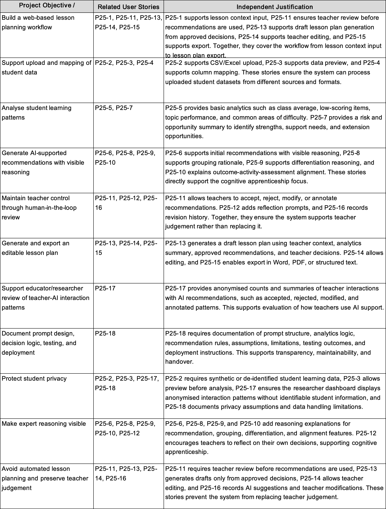

    UNSW COMP9900 Information Technology Project

    Project Proposal

### Project Information

| Component                        | Information                                                  |
| :------------------------------- | :----------------------------------------------------------- |
| **Course Code and Course Title** | COMP9900 - Information Technology Project                     |
| **Project Number and Title**     | Project 26 AI Mediated Teacher Decision Support Tool for Data Informed Lesson Planning |
| **Team Name**                    | F15C-BREAD                                                |
| **Project Client**               | Sara Mashayekh                                             |
| **Client Email**                 | sara.mashayekh@unsw.edu.au                                         |
| **Proposal Submission Date**     | 20 June 2026                                                 |

### Team Members

| Full Name         | Email                   | Student ID | Role          |
| :---------------- | :---------------------- | :--------- | :------------ |
| Yulong Jiang     | z5485481@ad.unsw.edu.au|  z5485481   | Scrum Master  |
| Qianyi Zhang      | z5623911@ad.unsw.edu.au | z5623911   | Product Owner |
| Xingqian She        | z5561648@ad.unsw.edu.au | z5561648   | Developer     |
| Huaijin Chen     | z5559709@ad.unsw.edu.au | z5559709   | Developer     |
| Yi Zhu      | z5529745@ad.unsw.edu.au  | z5529745   | Developer     |
| Yihong Yao | z5593964@ad.unsw.edu.au | z5593964   | Developer     |

---

## Table of Contents

1. Background  
   1.1 Problem Definition and Impact  
   1.2 Review of Existing Systems  

2. User Stories and Sprints  
   2.1 Scope Statement  
   2.2 Sprint 1 User Stories  
   2.3 Product Backlog  
   2.4 Sprint Timeline and Milestones  

3. Technical Design  
   3.1 System Architecture and Backend/Data Design  
   3.2 Interface Storyboarding  
   3.3 Design Justifications  
   3.4 Functionality Mapping  

4. References

## 1. Background

### 1.1 Problem Definition and Impact

**Problem Domain**
Data-informed teaching method has become an important part of modern educational practice (Mandinach & Gummer, 2016). The Australian Professional Standards for Teachers also highlight that teachers should use assessment data to understand students' learning needs, improve their teaching, and help students progress (AITSL, 2011). 

Ideally, teachers should use data from various sources to plan courses. However, there are some Challenges.

**Current Challenges**
* **Inability to Interpret Data Patterns:** Identifying common misconceptions or recognising differences between students based on collected data rather than communicating directly with students is not an easy task for pre-service and novice teachers. Understanding the data itself is already a challenge, let alone translating that information into appropriate instructional decisions (Mandinach & Gummer, 2016).
* **Pedagogical Experience Gap:** A single indicator, such as a low score on a specific question, may correspond to multiple underlying causes, like a student's knowledge gap or a poorly designed assessment. Pre-service teachers often feel confused when interpreting these indicators because they lack the necessary pedagogical experience to connect data with teaching strategies.
* **Invisible Reasoning in Planning:** Pre-service teachers often lack effective support in turning student data into evidence-based lesson planning decisions, primarily because the expert reasoning required for this process remains invisible to them.
* **Black-Box AI System Constraints:** Existing generative AI tools appear to have the potential to become an effective tool since they can quickly generate lesson plans and teaching materials (UNESCO, 2023). However, many of these tools focus on producing outputs rather than helping teachers understand the reasoning behind educational decisions (UNESCO, 2023).
* **High Administrative Overload:** Teachers often work under significant time and workload pressures. According to the OECD TALIS 2024 report, around 52% of teachers identify administrative work as a source of work-related stress, while 37% report that modifying lessons for students with special education needs is a source of stress (OECD, 2025).

**Impact**
* **Compromised Critical Analysis Time:** From the perspective of pre-service teachers, generative AI tools do not seem to effectively solve their dilemma, and may even make the situation worse because when they receive a complete lesson plan from generative AI tools, they may not have enough time to explore 'why' but to follow AI's plan.
* **Over-Dependence and Deskilling:** If unaddressed, pre-service teachers and novice teachers may become overly dependent on AI-generated content, failing to develop the professional judgement required to evaluate and adapt pedagogical strategies independently. Ultimately, generative AI tools will make teacher become an executor of AI's plans.

**Proposed Solution Summary**
This project proposes an AI-mediated teacher decision support system based on the Cognitive Apprenticeship framework (Collins et al., 1986), rather than replacing teachers.

* **Input:** Lesson information and student learning data (e.g., Kahoot, Quizizz, Google Forms, CSV).
* **Analysis & Generation:** Our system will identify learning patterns, potential learning needs, and generate recommendations.
* **The 'Why' Effect:** Our system will explain the reasoning behind every recommendation, show how student data influenced the recommendation, how it relates to learning outcomes, and why a particular teaching strategy may be appropriate in the current situation.
* **Interaction & Output:** Teachers can accept, reject, modify, or annotate AI-generated suggestions, then they can build and export a final lesson plan.

By making expert reasoning visible, the system aims not only to reduce the effort required to interpret student data but also to help pre-service teachers develop data literacy, lesson planning skills, and professional judgement over time.

### 1.2 Review of Existing Systems

**System 1: Generative AI Lesson Planning Tools**
* **Problem Solved:** Generative AI lesson planning tools can help teachers create lesson plans, classroom activities, assessment tasks, and teaching resources quickly, thereby alleviating teachers’ problems of high pressure and tight timelines in preparing lessons. Representative frameworks include:
    * *ChatGPT:* An LLM that has parsed extensive web indexes and books (OpenAI, 2026). Teachers can directly send data to ChatGPT and receive suggestions.
    * *MagicSchool AI:* An AI platform developed specifically for teachers and school administrators (MagicSchool AI, 2026) where educators do not need to think about complicated prompts and only need to input parameters such as grade level and topic into form fields.
* **Strengths for Reference:** A major strength of these tools is their flexibility and adaptability. They can generate lesson plans, activities, assessment tasks, explanations, and feedback for different subjects, year levels, and learning contexts (Denny et al., 2024).
* **Limitations Addressed by Our Project:** Most generative AI lesson planning tools focus on producing outputs rather than explaining the outputs. It remains a black box to teachers. Teachers may receive a complete lesson plan without understanding how the recommendation relates to student data. This may limit the pedagogical development of pre-service and novice teachers. Our project addresses this limitation by treating teachers as active decision makers rather than passive users of AI-generated content. In order to overcome the limitations and preserve the advantages of Generative AI lesson planning tools, Our system will explain the reasoning why make the recommendations. Our System will also encourage teachers to review, compare, and modify suggestions before making final decisions. Making thinking visible is the principle of our system.

**System 2: Learning Analytics Dashboards**
* **Problem Solved:** Learning analytics dashboards are good tools for teachers to visualise and manage student learning data. Representative platforms include:
    * *Canvas Analytics:* Records students' comprehensive performance and learning behaviours in the whole semester or course process (Canvas LMS, 2026).
    * *Kahoot Reports:* A gamified interactive learning platform. After playing games in class or after class, it can generate reports to provide useful reference data for checking students' learning situation (Kahoot, 2026).
* **Strengths for Reference:** A major strength of these systems is their ability to present large amounts of learning data in a clear and accessible way (Canvas LMS, 2026). Data visualisation and summary reports can help teachers in many ways, such as identify students' overall grasp of knowledge.
* **Limitations Addressed by Our Project:** A main limitation of these systems is that they only show past data, but cannot actively support teachers to make next teaching decisions. Although they can help teachers in many ways, such as find students' learning problems, they seldom tell teachers what to do next. They also rarely explain why a teaching method is suitable. Our project aims to solve this problem and connect data analysis with real teaching. When finding a learning problem, the system will give some teaching suggestions, explain the reasons, and show how they relate to students' data. Teachers still make the final decisions, but the system can provide useful help in the whole teaching process.

---

## 2. User Stories and Sprints

### 2.1 Scope Statement

The prototype will support input lesson context. We are going to deliver a web-based AI-mediated lesson planning mentor for pre-service teachers. It can also support uploading CSV or Excel student learning data. It will support data mapping and learning analytics. It can generate recommendations with expert reasoning explanations. Teachers can make decisions like accept, reject, modify, or annotate. It allows for the construction of an editable lesson plan. It keeps a revision history and supports Word or PDF export. The system won’t work as an automated lesson generator. It won’t use identifiable student data or integrate with live school systems.

#### Out of Scope

The following items are outside the scope of this project:

- **Live system integration:** The prototype won’t integrate with live UNSW, school, Department of Education, or learning management systems. We will design it as a proof of concept. It will use uploaded CSV files or spreadsheet data.

- **Identifiable student data:** The system will only use made-up student learning data or data without students’ personal identity. It will not ask for any information that can identify a specific student.

- **Automated lesson plan generation without teacher review:** The system won’t generate a final lesson plan without teachers’ approval. Teachers have to check, accept, refuse, change or add notes to the AI-generated suggestions before using them in the lesson plan.

- **Replacing teacher judgement:** The system won’t make final teaching decisions for teachers. Teachers are still responsible for understanding the data, checking AI suggestions, and making the final lesson plan.

#### Client Approval Evidence

We have confirmed the project scope with the client Sara Mashayekh by email. After our first talk with her, the Product Owner sent an email to make several things clear: the scope we put forward, what Demo 1 is expected to show, main functions, and the work that is not included in this project.

The client wrote back and said the proposed scope fits her expectations very well. She also confirmed that this project should mainly focus on these parts: student data analysis, AI-supported suggestions, teachers’ review and control, making editable lesson plans, and the export function.

The client said Demo 1 needs to show the whole work process from start to end. So our first demo will be a complete but simple functional prototype. It has these functions: input lesson background information, upload and map student data, do basic learning data analysis, get AI suggestions with clear reasons, let teachers check and make decisions, make lesson plans, and export files.

Below is the screenshot of the client’s confirmation email, as proof that the client agrees with this plan.

### 2.2 Sprint 1 User Stories
This section discusses the Scrum planning of MentorPlan AI. Sprint 1 is stuck in foundation and core enabling functionality, including lesson context input, CSV/Excel upload, data preview, column mapping, basic learning analytics and an initial recommendation explanation. More advanced features like human-in-the-loop decision review, AI assisted lesson plan generation, revision history, export, and the educator/researcher dashboard are in the product backlog for future sprint planning.

Total estimated product scope is 78 story points. Sprint 1 has 26 story points, which is approximately one-third of the total estimated work. We make this allocation to avoid both overcommitment and undercommitment and to ensure the team has a functional end-to-end foundation to show by the first progressive demo.

**Jira** **Evidence:**

| Jira Key | User Story | Priority | Story Points |
| :--- | :--- | :--- | :---: |
| **P25-1** | As a pre-service teacher, I want to enter lesson context, so that recommendations are aligned with my teaching goals. | High | 3 |
| **P25-2** | As a pre-service teacher, I want to upload CSV/Excel student learning data, so that the system can analyse class learning patterns. | High | 5 |
| **P25-3** | As a pre-service teacher, I want to preview uploaded data, so that I can verify the dataset before analysis. | High | 3 |
| **P25-4** | As a pre-service teacher, I want to map data columns, so that the system can interpret different dataset formats. | High | 5 |
| **P25-5** | As a pre-service teacher, I want to view basic learning analytics, so that I can understand class strengths and areas needing support. | High | 5 |
| **P25-6** | As a pre-service teacher, I want early recommendations to include visible reasoning, so that I can understand why a suggestion is made. | High | 5 |

#### Sprint 1 Acceptance Criteria

| Jira Key | Acceptance Criteria |
| :--- | :--- |
| **P25-1** | Given I am on the lesson context page, when I enter the year level, subject area, topic, learning outcomes, lesson goals, learner needs, and constraints, then the system saves the lesson context and makes it available for later analytics and recommendation generation. If required fields are missing, the system displays a clear validation message.|
| **P25-2** | Given I am on the data upload page, when I upload a valid CSV or Excel file using synthetic or de-identified student learning data, then the system accepts the file and stores the dataset metadata. If the file type is invalid or the file is empty, the system displays an appropriate error message.|
| **P25-3** | Given a dataset has been uploaded successfully, when I open the data preview page, then the system displays the first rows and column names of the dataset. The preview must allow the teacher to confirm whether the uploaded data is correct before proceeding to mapping and analysis.|
| **P25-4** | Given the uploaded dataset contains columns such as student ID, question or item number, score, topic, skill area, learning outcome, or misconception category, when I map these columns to the required system fields, then the system validates the mapping and stores it. If required mappings are missing, the system prevents analysis and explains what must be fixed.|
| **P25-5** | Given the dataset has been uploaded and mapped successfully, when I run the basic analytics module, then the system displays class-level learning patterns including class average, low-scoring items, topic performance, common areas of difficulty, and possible extension opportunities. The analytics language must avoid deterministic labels such as “weak students”.|
| **P25-6** | Given basic analytics results are available, when the system generates an initial teaching recommendation, then the recommendation includes a short explanation of the supporting data evidence and expert lesson planning reasoning. The teacher should be able to understand why the suggestion was made, even if the full accept/reject/modify workflow is implemented in a later sprint.|

### 2.3 Product Backlog
The product backlog below contains user stories not yet committed to Sprint 1. These stories are not yet assigned to a sprint as per Scrum progressive planning principles. Based on Sprint 1 outcomes, team velocity, client feedback and technical dependencies, they will be prioritised and selected for Sprint 2 or Sprint 3.

**Jira** **Evidence:**

| Jira Key    | User Story | Priority | Story Points | Status | Acceptance Criteria Summary |
| :--- | :--- | :--- | :---: | :---: | :--- |
| **P25-7** | As a pre-service teacher, I want to view a risk and opportunity summary, so that I can identify possible learning needs before planning the lesson. | High | 5 | Backlog | The system summarises class-wide risks, strengths, possible support needs, and extension opportunities using careful, non-deterministic language.|
| **P25-8** | As a pre-service teacher, I want student grouping suggestions with rationale, so that I can form groups based on learning needs, mixed ability, or extension opportunities. | High | 5 | Backlog | The system suggests possible student groups and explains the data evidence and pedagogical reasoning behind each grouping. Teachers can later edit or reject groups.|
| **P25-9** | As a pre-service teacher, I want differentiation recommendations with expert reasoning, so that I can adapt activities for different learner needs. | High | 5 | Backlog | The system recommends strategies such as reteaching, scaffolding, targeted practice, peer support, and extension, with reasoning linked to analytics and learning outcomes.|
| **P25-10** | As a pre-service teacher, I want to see how each recommendation aligns with learning outcomes, activities, and assessment, so that I can understand the expert planning logic behind the recommendation. | High | 3 | Backlog | Each recommendation includes learning outcome alignment, activity rationale, and assessment alignment.|
| **P25-11** | As a pre-service teacher, I want to accept, reject, modify, or annotate AI-generated recommendations, so that I remain responsible for pedagogical decisions. | High | 5 | Backlog | Recommendation cards provide accept, reject, modify, and annotation actions. Teacher decisions are saved for later lesson plan generation and revision history.|
| **P25-12** | As a pre-service teacher, I want teacher reflection prompts, so that I can justify key pedagogical decisions. | Medium | 3 | Backlog | The system prompts teachers to explain why they accepted, rejected, or changed suggested groupings, differentiation strategies, or lesson priorities.|
| **P25-13** | As a pre-service teacher, I want an AI-supported draft lesson plan based on approved decisions, so that I can construct a data-informed lesson plan efficiently. | High | 8 | Backlog | The system generates a draft lesson plan using teacher context, analytics summary, approved recommendations, and teacher decisions. The draft must not be generated directly from raw CSV data alone.|
| **P25-14** | As a pre-service teacher, I want to edit the generated lesson plan, so that the final plan reflects my professional judgement. | High | 3 | Backlog | The lesson plan editor allows teachers to revise lesson objectives, activities, differentiation notes, assessment tasks, and teacher notes before export.|
| **P25-15** | As a pre-service teacher, I want to export the final lesson plan, so that I can use it outside the system. | Medium | 3 | Backlog | The system exports the final lesson plan in a usable format such as Word, PDF, or structured text.|
| **P25-16** | As a pre-service teacher, I want to view revision history, so that I can see how the AI suggestions changed after teacher review. | Medium | 3 | Backlog | The system records the original AI recommendation, teacher decision, modified content, and final lesson plan component.|
| **P25-17** | As an educator or researcher, I want to view anonymised teacher interaction patterns, so that I can understand how teachers accept, reject, modify, or annotate AI recommendations. | Medium | 5 | Backlog | The dashboard shows anonymised counts and summaries of teacher interactions with AI recommendations. No identifiable student information is displayed.|
| **P25-18** | As a project stakeholder, I want prompt design, decision logic, testing, and deployment documentation, so that the prototype can be demonstrated and handed over transparently. | Medium | 4 | Backlog | The team documents prompt structure, analytics logic, recommendation rules, assumptions, limitations, testing outcomes, and deployment or demonstration instructions.|

### 2.4 Sprint Timeline and Milestones
The project will be split into 3 main sprints. Sprint 1 is about the basic functionality. We expect that Sprint 2 will have the largest feature workload which will include recommendation reasoning, human-in-the-loop review and AI lesson plan generation. The team will also prepare for final demo, final report, software quality submission, documentation and project handover, so there is less development workload in Sprint 3.

The assessment guidance recommends allocating roughly one third of the total estimated story points to Sprint 1, prioritising foundation functionality in Sprint 1, major feature integration in Sprint 2, and finalisation, testing, documentation and handover in Sprint 3. This informs the sprint allocation.

| Sprint | Dates | Sprint Goal | Key Milestones / Deliverables |
| :---: | :--- | :--- | :--- |
| **Sprint 1** | Week 3 Wednesday after proposal submission – Week 5 Lab Time | Build the core foundation of the teacher workflow.| Lesson context form completed; CSV/Excel upload implemented; data preview implemented; column mapping prototype completed; basic analytics dashboard implemented; initial recommendation with visible expert reasoning generated; Sprint 1 review and retrospective prepared.|
| **Sprint 2** | Week 5 Lab Time – Week 8 Lab Time | Implement major recommendation, reasoning, and human-in-the-loop functionality.| Risk and opportunity summary implemented; grouping recommendation with rationale implemented; differentiation recommendation with expert reasoning implemented; outcome-activity-assessment alignment explanation implemented; accept/reject/modify/annotate workflow implemented; teacher reflection prompts implemented; AI-supported lesson plan generation prototype completed; Sprint 2 progressive demo and retrospective prepared.|
| **Sprint 3** | Week 8 Lab Time – Week 10 Lab Time | Finalise export, revision history, dashboard, testing, deployment, and documentation.| Lesson plan editor completed; export function implemented; revision history implemented; educator/researcher dashboard implemented; prompt and decision logic documentation completed; synthetic dataset and demonstration workflow prepared; system testing and UI polish completed; final demo, final report, software quality submission, and handover prepared.|

---

## 3. Technical Design

### 3.1 System Architecture and Backend/Data Design

#### 3.1.1 System Architecture Diagram - Overview

Dashed boxes represent third-party services.

The System Architecture Diagram presents the layered architecture of MentorPlan AI. The frontend handles teacher-facing workflows, while the FastAPI controller layer only performs routing, JWT authentication, and request validation. Business logic is placed in the service layer, including data cleaning, learning analytics, recommendation generation, expert reasoning, teacher decisions, prompt building, lesson plan generation, revision history, export, and interaction logging.

#### 3.1.2 Component Description Table

| Layer       | Component                    | Responsibility                                                                                          | Key Data / Interaction                       |
| :---------- | :--------------------------- | :------------------------------------------------------------------------------------------------------ | :------------------------------------------- |
| Frontend    | React + TypeScript Web App   | Login, context input, upload, mapping, analytics, reasoning display, editor, export, history, dashboard | Axios + JWT calls backend APIs               |
| API         | FastAPI Controllers          | Authentication, context, upload, mapping, analytics, recommendations, decisions, plans, export          | Routing, validation, and authentication only |
| Service     | Business Modules             | File checks, cleaning, analytics, recommendations, decisions, prompts, plans, exports, versions, logs   | Runs the main workflow                       |
| Core        | Reasoning + Alignment        | Evidence, expert logic, outcome/activity/assessment fit, differentiation                                | Shows AI thinking to teachers                |
| AI Boundary | AI Adapter + LLM APIs        | Connects to LLMs and validates structured output                                                        | No raw student files are sent                |
| Data Access | Repositories + Storage Tools | One repository per domain object                                                                        | Only layer that reads and writes data        |
| Persistence | PostgreSQL + Object Storage  | Database for forms and JSON; file storage for uploads and exports                                       | Large files stay outside the database        |

#### 3.1.3 API / Data Flow Explanation

| Step                  | Example API                              | Data Flow                                                                              |
| :-------------------- | :--------------------------------------- | :------------------------------------------------------------------------------------- |
| 1. Context + Upload   | Create context; upload dataset           | Lesson context is saved to the database; raw CSV/Excel files are saved to file storage |
| 2. Mapping + Cleaning | Map columns; validate data               | Dataset columns are mapped to standard fields; cleaned student responses are saved     |
| 3. Analytics          | Get dataset analytics                    | Class patterns, low-scoring areas, and common mistakes are saved as JSON               |
| 4. Recommendations    | Get lesson suggestions                   | Teaching strategies are generated with evidence and alignment notes                    |
| 5. Teacher Decisions  | Submit decision records                  | Accept, reject, edit, and comment actions are saved                                    |
| 6. Plan + Export      | Generate, update, and export lesson plan | AI uses summaries and approved actions; lesson plans and exported files are saved      |
| 7. Research Dashboard | Get interaction statistics               | Anonymous teacher actions are summarised for researchers                               |

#### 3.1.4 Initial Database Entity List

| Table                  | Key Fields                                                                                   | Purpose                         |
| :--------------------- | :------------------------------------------------------------------------------------------- | :------------------------------ |
| `users`                | `user_id`, `email`, `role`                                                                   | Teacher and researcher accounts |
| `lesson_contexts`      | `context_id`, `user_id`, `year`, `subject`, `topic`, `outcomes JSON`                         | Basic lesson context            |
| `datasets`             | `dataset_id`, `context_id`, `file name`, `storage URI`, `rows`, `status`                     | Uploaded file metadata          |
| `column_mappings`      | `mapping_id`, `dataset_id`, `source column`, `target field`                                  | Column-to-field mapping         |
| `student_responses`    | `response_id`, `dataset_id`, `student ref`, `topic`, `score`, `max`, `correct`               | Anonymised response data        |
| `analytics_results`    | `analytics_id`, `dataset/context id`, `summary JSON`                                         | Class analytics                 |
| `recommendations`      | `recommendation_id`, `analytics_id`, `evidence`, `reasoning`, `alignment`, `differentiation` | AI suggestions and reasoning    |
| `teacher_decisions`    | `decision_id`, `recommendation/user id`, `decision`, `edits`, `notes`                        | Teacher review actions          |
| `lesson_plans`         | `plan_id`, `context/user id`, `current version`, `status`                                    | Current lesson plan             |
| `lesson_plan_versions` | `version_id`, `plan_id`, `version`, `content JSON`, `source`                                 | Plan revision history           |
| `exports`              | `export_id`, `plan/version id`, `format`, `storage URI`                                      | Exported Word/PDF records       |
| `interaction_logs`     | `log_id`, `user/recommendation id`, `event`, `metadata JSON`                                 | Anonymous research logs         |

#### 3.1.5 Privacy and AI Boundary

Privacy is treated as a strict design requirement.

Raw student files remain in object storage and are not sent directly to the AI model. The AI only receives summaries, approved teacher actions, and templates. Teachers review AI suggestions before those suggestions are used in final lesson plans.

This design reduces privacy risk, supports teacher agency, and ensures that AI remains a decision-support tool rather than a replacement for teacher judgement.

---

### 3.2 Interface Storyboarding

These set of storyboards are the main interfaces of our application, that show the UI layout and a part of user interactions.

We will use these storyboards to introduce how teachers work with functions, including term overview, lesson review, student data and AI-supported analysis that support lesson plan. 

#### 3.2.1 Dashboard Page

**Related user stories:** P25-5, P25-7, P25-8, P25-17

The Dashboard provides the overview of all courses and their weekly progress. It includes two parts: Term Overview and Lesson Overview.

The Term Overview section can be considered as a variation of a flow chart. It contains courses across the whole term, with learning levels (Initial, High, Mid, and Low). This helps teachers get a quick view of the term before they opening a specific course.

The Lesson Overview section uses course cards to provide more information about each course. It includes the course name, number of students, and estimated support groups. Courses in the current term will be displayed some support groups such as Intensive Support, Targeted Support, Core Instruction, and Extension, while future courses are visually separated to reduce distraction from current planning work.

#### 3.2.2 Lessons Page

**Related user stories:** P25-5, P25-7, P25-8, P25-9, P25-10

The Lessons page presents more detailed information once the teacher selects a course. A course list is placed on the left side to help teachers easily switch between courses. 

While the main panel shows the course summary, including basic cource information like course code, term, number of students, current week, completion percentage, and student distribution.

The second section is Support Groups, it shows groups such as Intensive Support, Targeted Support, Core Instruction, and Extension. Each group card displays the number of students and provides actions for editing or managing the group. 

Also, as an AI drived Web Application, we provide the AI Group Analysis section which is able to analyze current student data, identify their unique strengths and learning weaknesses, also help teachers effectively group students through appropriate aggregation. Later features will provide further suggestions and assistance to each generated group.

#### 3.2.3 Students Page

**Related user stories:** P25-2, P25-3, P25-4, P25-5

The main function of the Student Page is to provide a place for teachers to review and verify student data. Teachers can view all uploaded student data here and also upload new data for AI-assisted analysis.

The data uploaded by teachers will be automatically categorized by AI under the created course items, providing a foundation for the next step of lesson plan creation.

#### 3.2.4. AI Planner: Data & Analysis Page

**Related user stories:** P25-1, P25-2, P25-3, P25-4, P25-5, P25-6

The AI Planner function start from the Data & Analysis page. In this step, teachers select which item and data they want to use for analysis, such as exams,  assignments, or knowledge checkpoints.

Each dataset card shows the data type, title, week, student count, coverage percentage, and upload time. After selection, the Student Distribution section summarises the data into groups. Teachers can also add more context in the Teacher Input section, which allows the system to consider information and opinions that directly from teachers. The AI Mentor panel provides an initial reasoning note based on the selected data and teacher input.

#### 3.2.5 AI Planner: Recommendations Page

**Related user stories:** P25-6, P25-8, P25-9, P25-10, P25-11, P25-12

The Recommendations page presents AI-supported lesson suggestions. The suggestions are organised into categories, such as Learning Activities and Differentiation, so teachers can separately review different types of planning support .

Teachers can browse all the suggestion cards and their corresponding student groups, select the most suitable solution, and if any solution needs improvement, teachers can click on the corresponding card and provide suggestions in the AI dialog box on the right.

#### 3.2.6 AI Planner: Review & Export Page

**Related user stories:** P25-11, P25-13, P25-14, P25-15, P25-16

The Review & Export page is the final step of the AI Planner workflow. The page provides a button to export the lesson plan as a PDF or save it to resources. The AI Mentor panel keeps the reasoning trail visible, once the teacher want to check how the final plan relates to the earlier data analysis and recommendations. In this way, the final lesson plan is based on teachers' thinking and choices rather than only being generated from student data.

#### 3.2.7 Overall Workflow

The whole workflow starts from the Dashboard, where teachers can check term progress and courses. They then can open the Lessons page to review course details and assessment information, divided students into groups and give them specific helps. After that, Students page can be used to check or upload student data. Finally, enter AI Planner to select uploaded data, after reviewing AI-supported recommendations, teachers confirm and export the final lesson plan.

Across these storyboards, MentorPlan AI provides evidence-based lesson planning and keeping teachers involved in each decision making.

---

### 3.3 Functionality Mapping

The following table shows the project objectives, main functions, and related user stories.

                   

------

### 3.4 Design Justifications

The system is designed based on the theory of cognitive apprenticeship. This project aims to develop an artificial intelligence-assisted curriculum planning guidance tool. It can help teachers create curriculum plans and show the logic behind them.

For example, the system explains the data evidence, the connection with learning outcomes, the reason for activity design, the choice of assessment methods, and the logic of differentiated teaching. In this way, novice teachers can better connect student learning data, learning outcomes, learning activities, assessment strategies, and learner needs.

#### 3.4.2 Subproblem Breakdown and Proposed Solutions

#### 3.4.3 Alternative Solutions Considered

Considering the project objectives, project timeline, system feasibility, privacy risks, and the theoretical direction of Group B, the project team compared several feasible methods, as shown in the table below.

#### 3.4.4 Novel Functionality Beyond Existing Systems

The project team studied two existing system categories: generative AI lesson planning tools and learning analytics dashboards. The limitations of these existing systems and the innovations of MentorPlan AI are shown in the table below.

#### 3.4.5 Limitations and Mitigation Strategies

Although this MVP can support data analysis and expert reasoning, there are still some limitations, as shown in the table below.

Overall, the MVP design gives priority to explainability, feasibility, privacy protection, and teacher control. Complex models, full retrieval-augmented generation, and advanced learning analytics can be considered as future work. At present, the system focuses on clearly showing the relationship between student data, suggestions, expert reasoning and teachers' decisions.

## 4. References

Australian Institute for Teaching and School Leadership. (2011). *Australian professional standards for teachers*. AITSL.

Collins, A., Brown, J. S., & Newman, S. E. (1986). *Cognitive apprenticeship: Teaching the craft of reading, writing, and mathematics* (Technical Report No. 403). Center for the Study of Reading, University of Illinois at Urbana-Champaign.

Denny, P., Gulwani, S., Heffernan, N. T., Käser, T., Moore, S., Rafferty, A. N., & Singla, A. (2024). *Generative AI for education (GAIED): Advances, opportunities, and challenges*. arXiv. https://doi.org/10.48550/arXiv.2402.01580

Instructure. (2026). *Canvas New Analytics*. https://www.instructure.com/canvas

Kahoot!. (2026). *Kahoot! reports and analytics*. https://kahoot.com/

MagicSchool AI. (2026). *MagicSchool AI: The AI platform for educators*. https://www.magicschool.ai/

Mandinach, E. B., & Gummer, E. S. (2016a). Every teacher should succeed with data literacy. *Phi Delta Kappan, 97*(8), 43–46. https://doi.org/10.1177/0031721716647018

Mandinach, E. B., & Gummer, E. S. (2016b). What does it mean for teachers to be data literate: Laying out the skills, knowledge, and dispositions. *Teaching and Teacher Education, 60*, 366–376. https://doi.org/10.1016/j.tate.2016.07.011

OECD. (2025). *Results from TALIS 2024: The state of teaching*. OECD Publishing. https://doi.org/10.1787/90df6235-en

OpenAI. (2026). *ChatGPT*. https://chat.openai.com/

UNESCO. (2023). *Guidance for generative AI in education and research*. UNESCO. https://doi.org/10.54675/EWZM9535
