

    UNSW COMP9900 Information Technology Project

    Project Proposal

### Project Information

| Component                        | Information                                                  |
| :------------------------------- | :----------------------------------------------------------- |
| **Course Code and Course Title** | COMP9900 - Information Technology Project                     |
| **Project Number and Title**     | Project 26 AI Mediated Teacher Decision Support Tool for Data Informed Lesson Planning |
| **Team Name**                    | F15C-BREAD                                                |
| **Project Client**               | Sara Mashayekh                                             |
| **Client Email**                 | sara.mashayekh@unsw.edu.au                                         |
| **Proposal Submission Date**     | 20 June 2026                                                 |

### Team Members

| Full Name         | Email                   | Student ID | Role          |
| :---------------- | :---------------------- | :--------- | :------------ |
| Yulong Jiang     | z5485481@ad.unsw.edu.au|  z5485481   | Scrum Master  |
| Qianyi Zhang      | z5623911@ad.unsw.edu.au | z5623911   | Product Owner |
| Xingqian She        | z5561648@ad.unsw.edu.au | z5561648   | Developer     |
| Huaijin Chen     | z5559709@ad.unsw.edu.au | z5559709   | Developer     |
| Yi Zhu      | z5529745@ad.unsw.edu.au  | z5529745   | Developer     |
| Yihong Yao | z5593964@ad.unsw.edu.au | z5593964   | Developer     |

---

## Table of Contents

1. Background  
   1.1 Problem Definition and Impact  
   1.2 Review of Existing Systems  

2. User Stories and Sprints  
   2.1 Scope Statement  
   2.2 Sprint 1 User Stories  
   2.3 Product Backlog  
   2.4 Sprint Timeline and Milestones  

3. Technical Design  
   3.1 System Architecture and Backend/Data Design  
   3.2 Interface Storyboarding  
   3.3 Design Justifications  
   3.4 Functionality Mapping  

4. References

## 1. Background

### 1.1 Problem Definition and Impact

**Problem Domain**
Data-informed teaching has become an important part of modern educational practice (Mandinach & Gummer, 2016). The Australian Professional Standards for Teachers also highlight that teachers should use assessment data to understand students' learning needs, improve their teaching, and help students progress (AITSL, 2011). Ideally, teachers should use various data sources, such as quiz results, assessment records, and classroom activities, to select targeted learning activities and assessment strategies.

**Current Challenges**
* **Inability to Interpret Data Patterns:** Identifying common misconceptions or recognising differences between students based on collected data is not an easy task for pre-service and novice teachers. Understanding the data itself is already a challenge, let alone translating that information into appropriate instructional decisions (Mandinach & Gummer, 2016).
* **Pedagogical Experience Gap:** A single indicator, such as a low score on a specific question, may correspond to multiple underlying causes, ranging from a student's knowledge gap to a poorly designed assessment. Pre-service teachers often feel confused when interpreting these indicators because they lack the necessary pedagogical experience to connect data with teaching strategies.
* **Invisible Reasoning in Planning:** Pre-service teachers often lack effective support in turning student data into evidence-based lesson planning decisions, primarily because the expert reasoning required for this process remains invisible to them.
* **Black-Box AI System Constraints:** Existing generative AI tools appear to have the potential to become an effective tool since they can quickly generate lesson plans and teaching materials (UNESCO, 2023). However, many of these tools focus on producing outputs rather than helping teachers understand the reasoning behind educational decisions (UNESCO, 2023).
* **High Administrative Overload:** Teachers often work under significant time and workload pressures. According to the OECD TALIS 2024 report, around 52% of teachers identify administrative work as a source of work-related stress, while 37% report that modifying lessons for students with special education needs is a source of stress (OECD, 2025).

**Impact**
* **Compromised Critical Analysis Time:** From the perspective of pre-service teachers, generative AI tools do not seem to effectively solve their dilemma, and may even make the situation worse because when they receive a complete lesson plan from generative AI tools, they may not have enough time to explore 'why' but to follow AI's plan.
* **Over-Dependence and Deskilling:** If unaddressed, pre-service teachers and novice teachers may become overly dependent on AI-generated content, failing to develop the professional judgement required to evaluate and adapt pedagogical strategies independently. Ultimately, this deskilling process reduces teacher agency and severely limits long-term professional growth.

**Proposed Solution Summary**
To address these challenges, this project proposes an AI-mediated teacher decision support system based on the Cognitive Apprenticeship framework (Collins et al., 1986), rather than replacing teachers. The core platform features encompass:

* **Input:** Teacher enters lesson information and uploads student learning data (e.g., Kahoot, Quizizz, Google Forms, CSV).
* **Analysis & Generation:** System identifies learning patterns, potential learning needs, and generates recommendations.
* **The 'Why' Effect:** Our system will explain the reasoning behind every recommendation, show how student data influenced the recommendation, how it relates to learning outcomes, and why a particular teaching strategy may be appropriate in the current context.
* **Interaction & Output:** Teachers can accept, reject, modify, or annotate AI-generated suggestions, then they can build and export a final lesson plan.

By making expert reasoning visible, the system aims not only to reduce the effort required to interpret student data but also to help pre-service teachers develop data literacy, lesson planning skills, and professional judgement over time.

### 1.2 Review of Existing Systems

**System 1: Generative AI Lesson Planning Tools**
* **Problem Solved:** Generative AI lesson planning tools can help teachers create lesson plans, classroom activities, assessment tasks, and teaching resources quickly, thereby alleviating teachers’ problems of high pressure and tight timelines in preparing lessons. Representative frameworks include:
    * *ChatGPT:* An LLM that has parsed extensive web indexes and books (OpenAI, 2026). Teachers can directly send data to ChatGPT and receive suggestions.
    * *MagicSchool AI:* An AI platform developed specifically for teachers and school administrators (MagicSchool AI, 2026) where educators do not need to think about complicated prompts and only need to input parameters such as grade level and topic into form fields.
* **Strengths for Reference:** A major strength of these tools is their flexibility and adaptability. They can generate lesson plans, activities, assessment tasks, explanations, and feedback for different subjects, year levels, and learning contexts (Denny et al., 2024).
* **Limitations Addressed by Our Project:** Most generative AI lesson planning tools focus on producing outputs rather than explaining the outputs. It remains a black box to teachers. Teachers may receive a complete lesson plan without understanding how the recommendation relates to student data, limiting the pedagogical development of pre-service and novice teachers. Our project addresses this limitation by treating teachers as active decision makers rather than passive users of AI-generated content. Instead of presenting solutions that are not reasoning visible, the system explains the reasoning behind recommendations and encourages teachers to review, compare, and modify suggestions before making final decisions, aligning with the Cognitive Apprenticeship principle of making expert thinking visible.

**System 2: Learning Analytics Dashboards**
* **Problem Solved:** Learning analytics dashboards help teachers collect, organise, and visualise student learning data well. These systems provide reports on quiz performance, learning progress, participation levels, and assessment results, helping teachers identify patterns in student achievement. Representative platforms include:
    * *Canvas Analytics:* Tracks a student's overall performance and activity throughout a semester or course cycle (Canvas LMS, 2026).
    * *Kahoot Reports:* A gamified interactive learning platform where reports generated after running classroom or post-class trivia games provide valuable diagnostic metrics (Kahoot, 2026).
* **Strengths for Reference:** A major strength of these systems is their ability to present large amounts of learning data in a clear and accessible way (Canvas LMS, 2026). Visualisations and summary reports can help teachers identify common misconceptions, low-performing topics, and students who may need additional support.
* **Limitations Addressed by Our Project:** These systems mainly focus on presenting historical information rather than actively supporting subsequent instructional decision-making. While they help teachers identify problems, they often provide limited support for deciding what teaching actions should be taken next. They also rarely explain why a particular intervention, grouping strategy, or differentiation approach may be suitable. Our project aims to bridge this gap between learning analytics and pedagogical action. When a learning issue is identified, the system will generate multiple instructional options, explain the reasoning behind each option, and show how each recommendation relates to student data and learning outcomes. Teachers remain responsible for making final decisions, but they receive structured support throughout the process.

---

## 2. User Stories and Sprints

### 2.1 Scope Statement

The prototype will support input lesson context. We are going to deliver a web-based AI-mediated lesson planning mentor for pre-service teachers. It can also support uploading CSV or Excel student learning data. It will support data mapping and learning analytics. It can generate recommendations with expert reasoning explanations. Teachers can make decisions like accept, reject, modify, or annotate. It allows for the construction of an editable lesson plan. It keeps a revision history and supports Word or PDF export. The system won’t work as an automated lesson generator. It won’t use identifiable student data or integrate with live school systems.

#### Out of Scope

The following items are outside the scope of this project:

- **Live system integration:** The prototype won’t integrate with live UNSW, school, Department of Education, or learning management systems. It will be designed as a proof of concept using uploaded CSV or spreadsheet data.

- **Identifiable student data:** The system will only use synthetic or de-identified student learning data. It won’t ask for identifiable student information.

- **Automated lesson plan generation without teacher review:** The system won’t generate a final lesson plan without teacher decision points. Teachers have to review, accept, reject, modify, or add notes to AI-generated recommendations before using them in the lesson plan.

- **Replacing teacher judgement:** The system won’t make final pedagogical decisions for the teacher. The teacher is still responsible for understanding the data, evaluating AI suggestions, and creating the final lesson plan.

#### Client Approval Evidence

The project scope has been confirmed with the client, Sara Mashayekh, through email. After the first discussion with the client, the Product Owner sent an email to confirm the proposed scope, Demo 1 expectations, major features, and items that are out of scope.

The client replied that the proposed scope aligns well with her expectations. She also confirmed that the project should focus on student data analysis, AI-supported recommendations, teacher review and control, editable lesson plan construction, and export functionality.

So, our first demo will be a complete but simple functional prototype. It has these functions: input lesson background information, upload and map student data, do basic learning data analysis, get AI suggestions with clear reasons, let teachers check and make decisions, make lesson plans, and export files. The client said Demo 1 needs to show the whole work process from start to end.

Below is the screenshot of the client’s confirmation email, as proof that the client agrees with this plan.

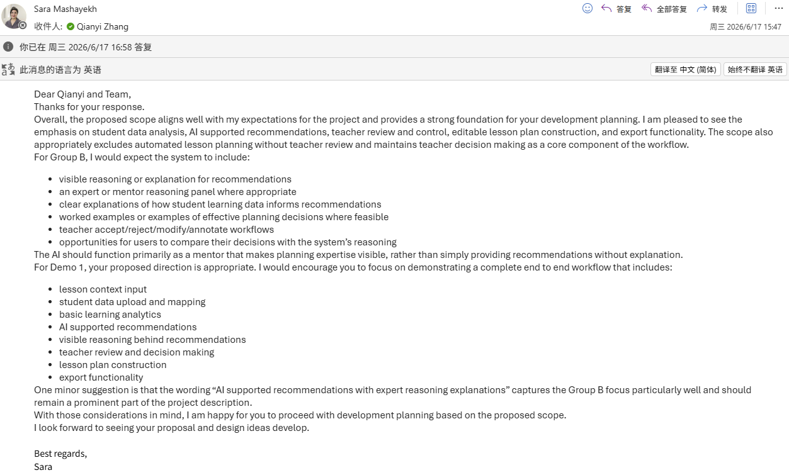

### 2.2 Sprint 1 User Stories
This section discusses the Scrum planning of MentorPlan AI. Sprint 1 is stuck in foundation and core enabling functionality, including lesson context input, CSV/Excel upload, data preview, column mapping, basic learning analytics and an initial recommendation explanation. More advanced features like human-in-the-loop decision review, AI assisted lesson plan generation, revision history, export, and the educator/researcher dashboard are in the product backlog for future sprint planning.

Total estimated product scope is 78 story points. Sprint 1 has 26 story points, which is approximately one-third of the total estimated work. We make this allocation to avoid both overcommitment and undercommitment and to ensure the team has a functional end-to-end foundation to show by the first progressive demo.

**Jira** **Evidence:**

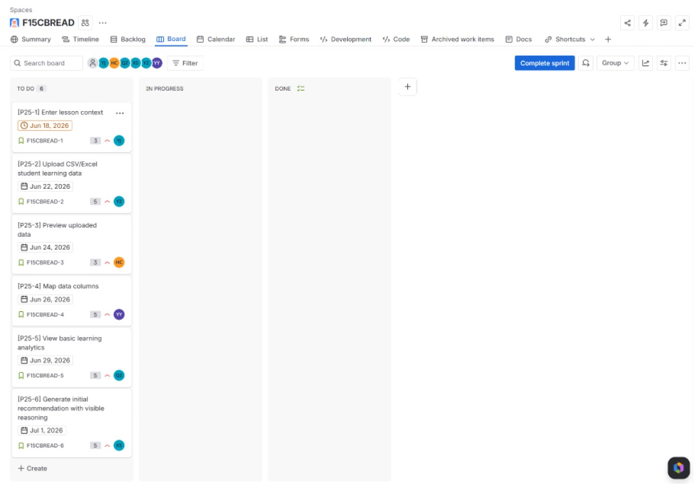

| Jira Key | User Story | Priority | Story Points |
| :--- | :--- | :--- | :---: |
| **P25-1** | As a pre-service teacher, I want to enter lesson context, so that recommendations are aligned with my teaching goals. | High | 3 |
| **P25-2** | As a pre-service teacher, I want to upload CSV/Excel student learning data, so that the system can analyse class learning patterns. | High | 5 |
| **P25-3** | As a pre-service teacher, I want to preview uploaded data, so that I can verify the dataset before analysis. | High | 3 |
| **P25-4** | As a pre-service teacher, I want to map data columns, so that the system can interpret different dataset formats. | High | 5 |
| **P25-5** | As a pre-service teacher, I want to view basic learning analytics, so that I can understand class strengths and areas needing support. | High | 5 |
| **P25-6** | As a pre-service teacher, I want early recommendations to include visible reasoning, so that I can understand why a suggestion is made. | High | 5 |

#### Sprint 1 Acceptance Criteria

| Jira Key | Acceptance Criteria |
| :--- | :--- |
| **P25-1** | Given I am on the lesson context page, when I enter the year level, subject area, topic, learning outcomes, lesson goals, learner needs, and constraints, then the system saves the lesson context and makes it available for later analytics and recommendation generation. If required fields are missing, the system displays a clear validation message.|
| **P25-2** | Given I am on the data upload page, when I upload a valid CSV or Excel file using synthetic or de-identified student learning data, then the system accepts the file and stores the dataset metadata. If the file type is invalid or the file is empty, the system displays an appropriate error message.|
| **P25-3** | Given a dataset has been uploaded successfully, when I open the data preview page, then the system displays the first rows and column names of the dataset. The preview must allow the teacher to confirm whether the uploaded data is correct before proceeding to mapping and analysis.|
| **P25-4** | Given the uploaded dataset contains columns such as student ID, question or item number, score, topic, skill area, learning outcome, or misconception category, when I map these columns to the required system fields, then the system validates the mapping and stores it. If required mappings are missing, the system prevents analysis and explains what must be fixed.|
| **P25-5** | Given the dataset has been uploaded and mapped successfully, when I run the basic analytics module, then the system displays class-level learning patterns including class average, low-scoring items, topic performance, common areas of difficulty, and possible extension opportunities. The analytics language must avoid deterministic labels such as “weak students”.|
| **P25-6** | Given basic analytics results are available, when the system generates an initial teaching recommendation, then the recommendation includes a short explanation of the supporting data evidence and expert lesson planning reasoning. The teacher should be able to understand why the suggestion was made, even if the full accept/reject/modify workflow is implemented in a later sprint.|

### 2.3 Product Backlog
The product backlog below contains user stories not yet committed to Sprint 1. These stories are not yet assigned to a sprint as per Scrum progressive planning principles. Based on Sprint 1 outcomes, team velocity, client feedback and technical dependencies, they will be prioritised and selected for Sprint 2 or Sprint 3.

**Jira** **Evidence:**

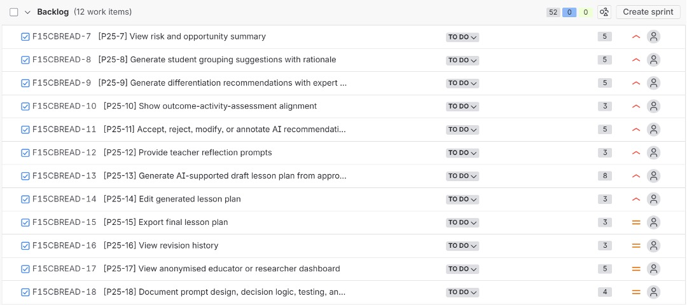

| Jira Key    | User Story | Priority | Story Points | Status | Acceptance Criteria Summary |
| :--- | :--- | :--- | :---: | :---: | :--- |
| **P25-7** | As a pre-service teacher, I want to view a risk and opportunity summary, so that I can identify possible learning needs before planning the lesson. | High | 5 | Backlog | The system summarises class-wide risks, strengths, possible support needs, and extension opportunities using careful, non-deterministic language.|
| **P25-8** | As a pre-service teacher, I want student grouping suggestions with rationale, so that I can form groups based on learning needs, mixed ability, or extension opportunities. | High | 5 | Backlog | The system suggests possible student groups and explains the data evidence and pedagogical reasoning behind each grouping. Teachers can later edit or reject groups.|
| **P25-9** | As a pre-service teacher, I want differentiation recommendations with expert reasoning, so that I can adapt activities for different learner needs. | High | 5 | Backlog | The system recommends strategies such as reteaching, scaffolding, targeted practice, peer support, and extension, with reasoning linked to analytics and learning outcomes.|
| **P25-10** | As a pre-service teacher, I want to see how each recommendation aligns with learning outcomes, activities, and assessment, so that I can understand the expert planning logic behind the recommendation. | High | 3 | Backlog | Each recommendation includes learning outcome alignment, activity rationale, and assessment alignment.|
| **P25-11** | As a pre-service teacher, I want to accept, reject, modify, or annotate AI-generated recommendations, so that I remain responsible for pedagogical decisions. | High | 5 | Backlog | Recommendation cards provide accept, reject, modify, and annotation actions. Teacher decisions are saved for later lesson plan generation and revision history.|
| **P25-12** | As a pre-service teacher, I want teacher reflection prompts, so that I can justify key pedagogical decisions. | Medium | 3 | Backlog | The system prompts teachers to explain why they accepted, rejected, or changed suggested groupings, differentiation strategies, or lesson priorities.|
| **P25-13** | As a pre-service teacher, I want an AI-supported draft lesson plan based on approved decisions, so that I can construct a data-informed lesson plan efficiently. | High | 8 | Backlog | The system generates a draft lesson plan using teacher context, analytics summary, approved recommendations, and teacher decisions. The draft must not be generated directly from raw CSV data alone.|
| **P25-14** | As a pre-service teacher, I want to edit the generated lesson plan, so that the final plan reflects my professional judgement. | High | 3 | Backlog | The lesson plan editor allows teachers to revise lesson objectives, activities, differentiation notes, assessment tasks, and teacher notes before export.|
| **P25-15** | As a pre-service teacher, I want to export the final lesson plan, so that I can use it outside the system. | Medium | 3 | Backlog | The system exports the final lesson plan in a usable format such as Word, PDF, or structured text.|
| **P25-16** | As a pre-service teacher, I want to view revision history, so that I can see how the AI suggestions changed after teacher review. | Medium | 3 | Backlog | The system records the original AI recommendation, teacher decision, modified content, and final lesson plan component.|
| **P25-17** | As an educator or researcher, I want to view anonymised teacher interaction patterns, so that I can understand how teachers accept, reject, modify, or annotate AI recommendations. | Medium | 5 | Backlog | The dashboard shows anonymised counts and summaries of teacher interactions with AI recommendations. No identifiable student information is displayed.|
| **P25-18** | As a project stakeholder, I want prompt design, decision logic, testing, and deployment documentation, so that the prototype can be demonstrated and handed over transparently. | Medium | 4 | Backlog | The team documents prompt structure, analytics logic, recommendation rules, assumptions, limitations, testing outcomes, and deployment or demonstration instructions.|

### 2.4 Sprint Timeline and Milestones
The project will be split into 3 main sprints. Sprint 1 is about the basic functionality. We expect that Sprint 2 will have the largest feature workload which will include recommendation reasoning, human-in-the-loop review and AI lesson plan generation. The team will also prepare for final demo, final report, software quality submission, documentation and project handover, so there is less development workload in Sprint 3.

The assessment guidance recommends allocating roughly one third of the total estimated story points to Sprint 1, prioritising foundation functionality in Sprint 1, major feature integration in Sprint 2, and finalisation, testing, documentation and handover in Sprint 3. This informs the sprint allocation.

| Sprint | Dates | Sprint Goal | Key Milestones / Deliverables |
| :---: | :--- | :--- | :--- |
| **Sprint 1** | Week 3 Wednesday after proposal submission – Week 5 Lab Time | Build the core foundation of the teacher workflow.| Lesson context form completed; CSV/Excel upload implemented; data preview implemented; column mapping prototype completed; basic analytics dashboard implemented; initial recommendation with visible expert reasoning generated; Sprint 1 review and retrospective prepared.|
| **Sprint 2** | Week 5 Lab Time – Week 8 Lab Time | Implement major recommendation, reasoning, and human-in-the-loop functionality.| Risk and opportunity summary implemented; grouping recommendation with rationale implemented; differentiation recommendation with expert reasoning implemented; outcome-activity-assessment alignment explanation implemented; accept/reject/modify/annotate workflow implemented; teacher reflection prompts implemented; AI-supported lesson plan generation prototype completed; Sprint 2 progressive demo and retrospective prepared.|
| **Sprint 3** | Week 8 Lab Time – Week 10 Lab Time | Finalise export, revision history, dashboard, testing, deployment, and documentation.| Lesson plan editor completed; export function implemented; revision history implemented; educator/researcher dashboard implemented; prompt and decision logic documentation completed; synthetic dataset and demonstration workflow prepared; system testing and UI polish completed; final demo, final report, software quality submission, and handover prepared.|

---

## 3. Technical Design

### 3.1 System Architecture and Backend/Data Design

#### 3.1.1 System Architecture Diagram - Overview

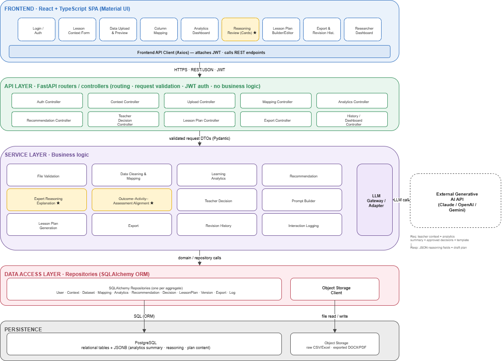

Dashed boxes represent third-party services.

The proposed system follows a layered web application architecture. It separates the frontend interface, API routing, business logic, AI interaction, data access, and persistent storage into different layers. This separation helps reduce coupling between components, makes the system easier to test, and ensures that sensitive student data is handled in a controlled way.

1. **Frontend: React + TypeScript SPA with Material UI**

   The frontend is a single-page web application used by teachers and researchers. It supports login, lesson context input, student data upload, column mapping, analytics, AI reasoning display, lesson plan editing, export, revision history, and researcher dashboard functions.

   Axios is used to attach JWT tokens and send secure HTTPS JSON requests to the backend.

2. **API Layer: FastAPI Controllers**

   The API layer routes requests, validates request data, and checks JWT authentication. It does not contain business logic.

   The main controllers include:

   * `auth`
   * `context`
   * `upload`
   * `mapping`
   * `analytics`
   * `recommendations`
   * `decisions`
   * `plan generation`
   * `export`

   Pydantic is used for request validation to standardise frontend request data.

3. **Service Layer: Business Logic**

   The service layer contains the main business logic of the system. It includes modules for file checks, data cleaning, analytics, recommendations, LLM gateway, prompt construction, teacher decisions, lesson plan generation, export, version control, and logging.

   The core modules are **expert reasoning** and **outcome-activity-assessment alignment**. These modules support the main goal of the system: making AI-supported decision-making visible and understandable to teachers.

   The AI adapter connects the system to different large language model services, such as Claude, Wenxin, GPT, Gemini, and other possible LLM providers.

   The AI input only includes lesson context, analytics summaries, approved teacher decisions, and templates. Raw student files are not sent to the AI model.

   The AI output is expected to be structured JSON containing recommendation reasoning and a draft lesson plan.

   Services read and write data only through repositories and file storage tools.

4. **Data Access Layer: SQLAlchemy Repositories and File Storage Client**

   The data access layer is responsible for database and file operations. It separates persistent data operations from business logic.

   The main repositories include:

   * `users`
   * `contexts`
   * `datasets`
   * `mappings`
   * `analytics`
   * `recommendations`
   * `decisions`
   * `plans`
   * `versions`
   * `exports`
   * `logs`

   These repositories handle SQL reads and writes, while the file storage client handles file reads and writes.

5. **Persistence Layer**

   The persistence layer contains two main storage components:

   * **PostgreSQL:** Stores form data and JSON fields for analytics, reasoning, and lesson plan content.
   * **Object Storage:** Stores raw Excel/CSV uploads and exported Word/PDF files.

#### 3.1.2 Five-Layer Summary

The system is organised into five layers:

1. Teachers use the web frontend to send secure backend requests.
2. The API layer checks user identity and request data format only.
3. The service layer handles analytics, recommendations, AI prompts, and teacher actions. Expert reasoning and outcome matching make AI thinking visible. The AI adapter hides differences between different model APIs. Raw student files remain private.
4. The data access layer handles database and file access.
5. Storage is split between the database and file storage. The database stores structured data, while file storage stores uploads and exports.

#### 3.1.3 Component Description Table

| Layer       | Component                    | Responsibility                                                                                          | Key Data / Interaction                       |
| :---------- | :--------------------------- | :------------------------------------------------------------------------------------------------------ | :------------------------------------------- |
| Frontend    | React + TypeScript Web App   | Login, context input, upload, mapping, analytics, reasoning display, editor, export, history, dashboard | Axios + JWT calls backend APIs               |
| API         | FastAPI Controllers          | Authentication, context, upload, mapping, analytics, recommendations, decisions, plans, export          | Routing, validation, and authentication only |
| Service     | Business Modules             | File checks, cleaning, analytics, recommendations, decisions, prompts, plans, exports, versions, logs   | Runs the main workflow                       |
| Core        | Reasoning + Alignment        | Evidence, expert logic, outcome/activity/assessment fit, differentiation                                | Shows AI thinking to teachers                |
| AI Boundary | AI Adapter + LLM APIs        | Connects to LLMs and validates structured output                                                        | No raw student files are sent                |
| Data Access | Repositories + Storage Tools | One repository per domain object                                                                        | Only layer that reads and writes data        |
| Persistence | PostgreSQL + Object Storage  | Database for forms and JSON; file storage for uploads and exports                                       | Large files stay outside the database        |

#### 3.1.4 API / Data Flow Explanation

All non-login APIs use HTTPS JSON requests with a valid JWT.

Controllers validate requests, services process them, and repositories read and write data.

| Step                  | Example API                              | Data Flow                                                                              |
| :-------------------- | :--------------------------------------- | :------------------------------------------------------------------------------------- |
| 1. Context + Upload   | Create context; upload dataset           | Lesson context is saved to the database; raw CSV/Excel files are saved to file storage |
| 2. Mapping + Cleaning | Map columns; validate data               | Dataset columns are mapped to standard fields; cleaned student responses are saved     |
| 3. Analytics          | Get dataset analytics                    | Class patterns, low-scoring areas, and common mistakes are saved as JSON               |
| 4. Recommendations    | Get lesson suggestions                   | Teaching strategies are generated with evidence and alignment notes                    |
| 5. Teacher Decisions  | Submit decision records                  | Accept, reject, edit, and comment actions are saved                                    |
| 6. Plan + Export      | Generate, update, and export lesson plan | AI uses summaries and approved actions; lesson plans and exported files are saved      |
| 7. Research Dashboard | Get interaction statistics               | Anonymous teacher actions are summarised for researchers                               |

#### 3.1.5 Initial Database Entity List

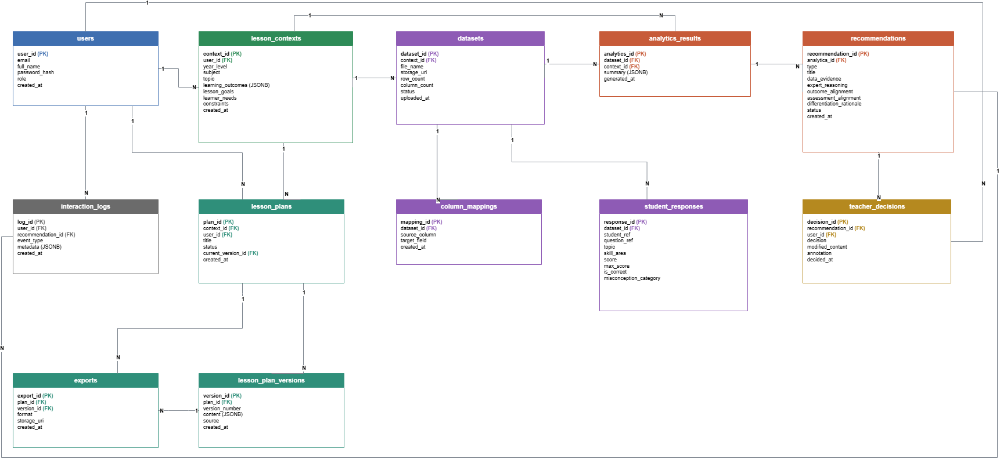

| Table                  | Key Fields                                                                                   | Purpose                         |
| :--------------------- | :------------------------------------------------------------------------------------------- | :------------------------------ |
| `users`                | `user_id`, `email`, `role`                                                                   | Teacher and researcher accounts |
| `lesson_contexts`      | `context_id`, `user_id`, `year`, `subject`, `topic`, `outcomes JSON`                         | Basic lesson context            |
| `datasets`             | `dataset_id`, `context_id`, `file name`, `storage URI`, `rows`, `status`                     | Uploaded file metadata          |
| `column_mappings`      | `mapping_id`, `dataset_id`, `source column`, `target field`                                  | Column-to-field mapping         |
| `student_responses`    | `response_id`, `dataset_id`, `student ref`, `topic`, `score`, `max`, `correct`               | Anonymised response data        |
| `analytics_results`    | `analytics_id`, `dataset/context id`, `summary JSON`                                         | Class analytics                 |
| `recommendations`      | `recommendation_id`, `analytics_id`, `evidence`, `reasoning`, `alignment`, `differentiation` | AI suggestions and reasoning    |
| `teacher_decisions`    | `decision_id`, `recommendation/user id`, `decision`, `edits`, `notes`                        | Teacher review actions          |
| `lesson_plans`         | `plan_id`, `context/user id`, `current version`, `status`                                    | Current lesson plan             |
| `lesson_plan_versions` | `version_id`, `plan_id`, `version`, `content JSON`, `source`                                 | Plan revision history           |
| `exports`              | `export_id`, `plan/version id`, `format`, `storage URI`                                      | Exported Word/PDF records       |
| `interaction_logs`     | `log_id`, `user/recommendation id`, `event`, `metadata JSON`                                 | Anonymous research logs         |

#### 3.1.6 Backend / Service Layer Explanation

The backend is divided into three main layers:

* **FastAPI Controllers**
* **Services**
* **Repositories**

Controllers route requests, authenticate users, and validate data. Services contain business logic. Repositories handle persistent reads and writes.

This layered structure keeps modules smaller, clearer, and easier to test.

The service layer includes the following modules:

1. **Data Services**

   These services validate uploaded files, clean student learning data, and generate analytics.

2. **Recommendation Services**

   These services create teaching strategy recommendations and AI reasoning explanations.

3. **Decision Services**

   These services store teacher review records, including accepted, rejected, edited, and commented recommendations.

4. **Prompt and Plan Services**

   These services call the AI model only after teacher approval. They use lesson context, analytics summaries, approved teacher decisions, and templates to generate lesson plan content.

5. **Export, Version, and Log Services**

   These services keep lesson plan versions, exported files, and teacher interaction records traceable.

#### 3.1.7 Privacy and AI Boundary

Privacy is treated as a strict design requirement.

Raw student files remain in object storage and are not sent directly to the AI model. The AI only receives summaries, approved teacher actions, and templates. Teachers review AI suggestions before those suggestions are used in final lesson plans.

This design reduces privacy risk, supports teacher agency, and ensures that AI remains a decision-support tool rather than a replacement for teacher judgement.

---

### 3.2 Interface Storyboarding

To illustrate the proposed user interactions and frontend layout of MentorPlan AI, we developed a set of high-fidelity interface storyboards. These storyboards demonstrate the major system functions, including course overview, lesson management, student data management, AI-supported data analysis, recommendation generation, and lesson plan export.

The interface follows a dashboard-based web application structure. A persistent top navigation bar allows teachers to move between Dashboard, Lessons, Students, and AI Planner. The AI Planner uses a step-by-step workflow: **Data & Analysis → Recommendations → Review & Export**. This design helps teachers progressively move from reviewing student data to understanding AI reasoning and finally exporting a teacher-approved lesson plan.

#### 3.2.1 Dashboard Page

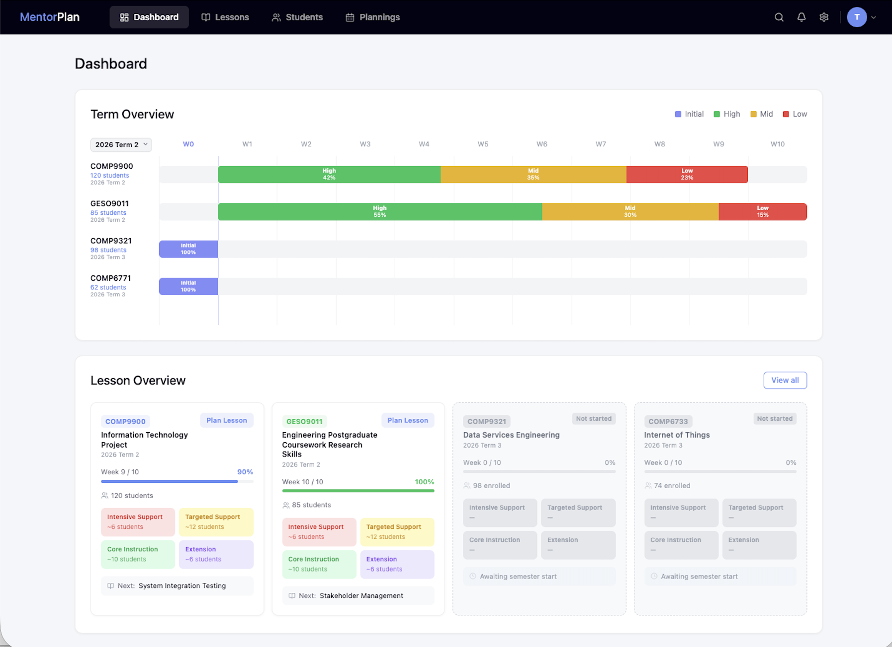

**Covered user stories:** P25-5, P25-7, P25-8, P25-17

The Dashboard page provides teachers with a high-level overview of their teaching term, courses, student performance distribution, and lesson planning progress. The page uses a clean card-based layout with a dark top navigation bar and a light background to separate navigation from working content.

The upper section, Term Overview, visualises multiple courses across weekly timelines. Each course row shows the current stage of the term and the distribution of student learning levels, such as Initial, High, Mid, and Low. This allows teachers to quickly identify which courses are active, which ones have not started, and which groups may require further support.

The lower section, Lesson Overview, displays course cards. Each card summarises course name, term, week progress, completion percentage, number of students, and support group estimates. For active courses, the card shows support categories such as Intensive Support, Targeted Support, Core Instruction, and Extension. For future courses, the card is visually disabled and marked as not started.

This storyboard supports the system objective of helping teachers interpret class-level learning patterns quickly. It also provides an entry point into more detailed lesson planning and support group analysis.

**Main interactions:**

* The teacher can switch between courses using the dashboard cards.
* The teacher can view the current term progress and course completion status.
* The teacher can identify which student support groups may need attention.
* The teacher can click into a course or lesson card to continue planning.

#### 3.2.2 Lessons Page

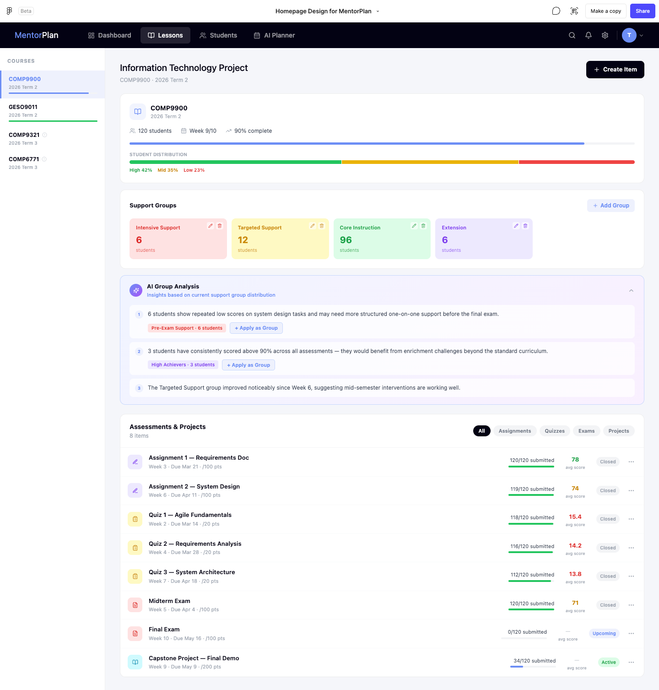

**Covered user stories:** P25-5, P25-7, P25-8, P25-9, P25-10

The Lessons page provides a course-level view for a selected subject. A left sidebar lists available courses, while the main content area shows detailed information about the selected course. This layout allows teachers to switch between courses without leaving the lesson management workflow.

At the top of the main panel, the selected course card displays course code, term, number of students, current week, completion percentage, and overall student distribution. This gives teachers a quick understanding of the course context before making planning decisions.

The Support Groups section summarises student groupings into categories such as Intensive Support, Targeted Support, Core Instruction, and Extension. Each support group card shows the number of students in that group and provides editing or management actions. This supports teacher control over AI-assisted grouping rather than forcing teachers to accept system-generated categories.

The AI Group Analysis section presents reasoning based on the current support group distribution. It explains patterns such as repeated low scores, high-achieving students requiring enrichment, or noticeable improvement after previous interventions. These explanations help make the AI reasoning process visible and interpretable.

The Assessments & Projects section lists assessment items, quizzes, exams, and projects. Each row shows submission progress, average score, and status. This helps teachers connect student data sources with lesson planning decisions.

**Main interactions:**

* The teacher can select different courses from the sidebar.
* The teacher can review support group distribution.
* The teacher can add, edit, or apply support groups.
* The teacher can inspect AI-generated group analysis.
* The teacher can view assessments and projects as evidence sources for planning.

#### 3.2.3 Students Page

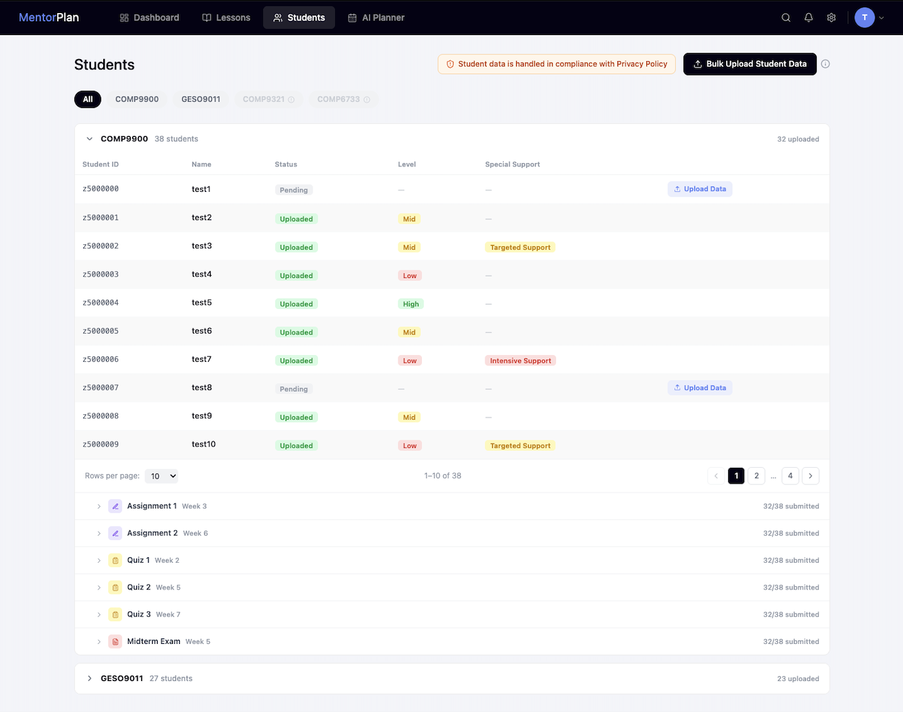

**Covered user stories:** P25-2, P25-3, P25-4, P25-5

The Students page focuses on student data management and upload status. It supports the data preparation stage before analytics and AI planning. The page includes course filters, privacy notice, student table, upload actions, and assessment submission summaries.

At the top of the page, course filter tabs allow teachers to view all students or only students from a specific course. A privacy notice reminds users that student data is handled according to privacy policy requirements. This reinforces the project’s design principle that only synthetic or de-identified student data should be used.

The main student table shows student ID, name, upload status, performance level, and special support category. Students with uploaded data are marked as Uploaded, while those without submitted data are marked as Pending and provide an Upload Data action. This helps teachers identify missing datasets before running analytics.

The lower part of the page lists assessment items such as assignments, quizzes, and exams. Each item includes submission progress, such as how many students have submitted data. This supports the data preview and verification workflow because teachers can check whether enough student data is available before proceeding to analysis.

**Main interactions:**

* The teacher can filter students by course.
* The teacher can bulk upload student data.
* The teacher can upload data for individual students.
* The teacher can review upload status and identify missing submissions.
* The teacher can expand assessment rows to inspect submission coverage.

#### 3.2.4 AI Planner: Data & Analysis Page

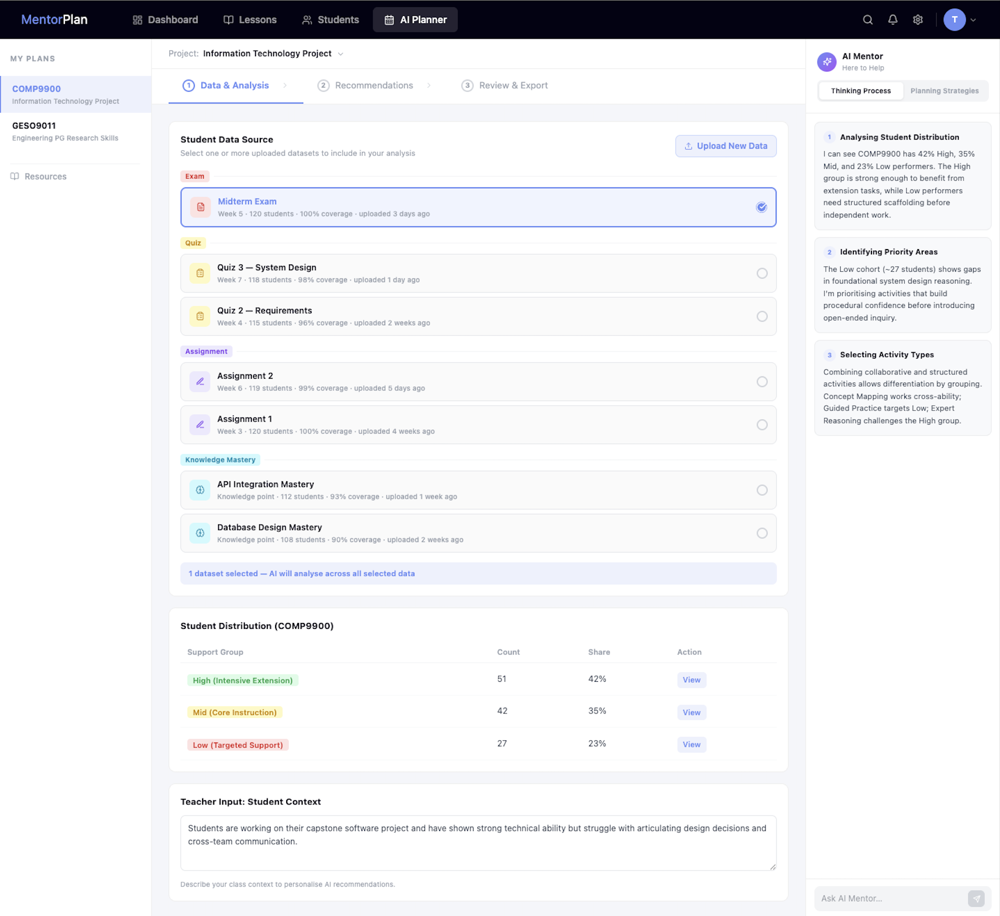

**Covered user stories:** P25-1, P25-2, P25-3, P25-4, P25-5, P25-6

The AI Planner begins with the Data & Analysis step. This screen allows teachers to choose the student data sources that will be used for AI-supported lesson planning. The left sidebar lists the teacher’s active plans, while the top stepper shows the three-stage workflow: Data & Analysis, Recommendations, and Review & Export.

The Student Data Source section lists available datasets, including exams, quizzes, assignments, and knowledge mastery checkpoints. Each dataset card shows the data type, title, week, number of students, coverage percentage, and upload time. Teachers can select one or more datasets for analysis. This design gives teachers control over which evidence is used by the system.

The Student Distribution section shows a summary of student performance groups for the selected dataset. In the example, students are divided into High, Mid, and Low groups with counts and percentage shares. Teachers can also view the details of each group.

The Teacher Input: Student Context section allows teachers to add contextual information that cannot be fully captured by numerical assessment data, such as class background, communication issues, project progress, or learning constraints. This supports more personalised and pedagogically appropriate AI recommendations.

A right-side AI Mentor panel explains the thinking process. It summarises how the AI interprets student distribution, identifies priority areas, and selects suitable activity types. This sidebar supports the system’s “why” effect by making the reasoning process visible rather than only showing final recommendations.

**Main interactions:**

* The teacher selects one or more uploaded datasets.
* The teacher reviews data coverage and student distribution.
* The teacher adds student context to personalise recommendations.
* The AI Mentor panel displays visible reasoning based on selected data.
* The teacher proceeds from data analysis to recommendation generation.

#### 3.2.5 AI Planner: Recommendations Page

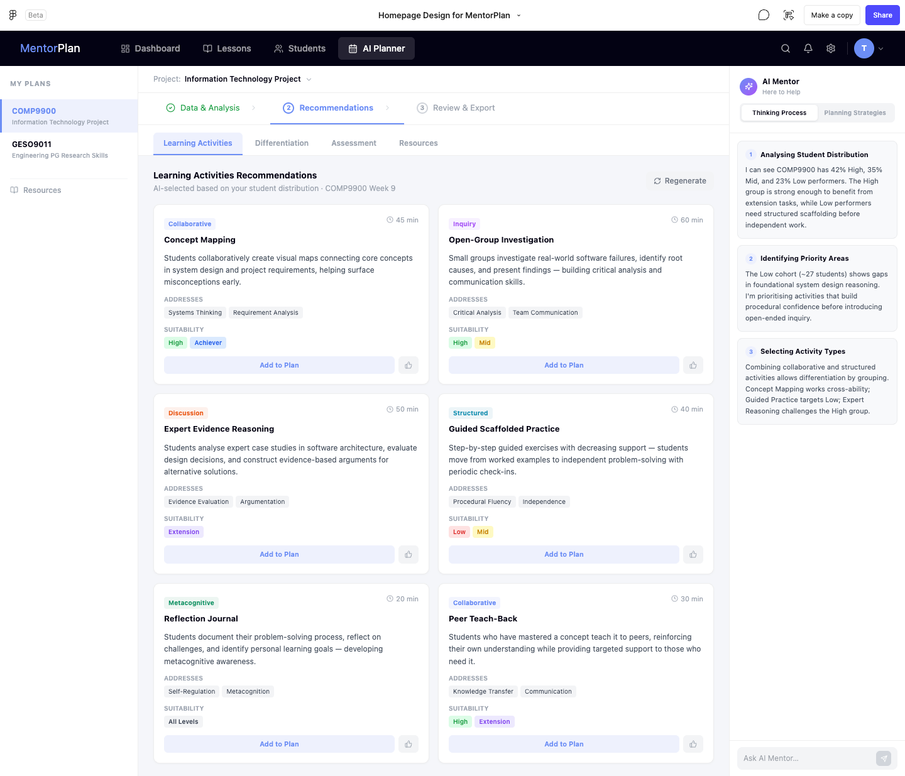

**Covered user stories:** P25-6, P25-8, P25-9, P25-10, P25-11, P25-12

The Recommendations page presents AI-generated lesson activity suggestions based on the selected student data and teacher-provided context. The page uses recommendation cards to display multiple possible teaching strategies instead of producing one final lesson plan immediately. This keeps the teacher in control of pedagogical decision-making.

The top stepper shows that the teacher has completed Data & Analysis and is now in the Recommendations stage. Recommendation categories include Learning Activities, Differentiation, Assessment, and Resources. This tab structure allows recommendations to be organised according to different lesson planning needs.

Each recommendation card contains an activity title, activity type, estimated duration, short description, addressed skills, suitability tags, and an Add to Plan button. Examples include Concept Mapping, Open-Group Investigation, Expert Evidence Reasoning, Guided Scaffolded Practice, Reflection Journal, and Peer Teach-Back. Suitability tags such as High, Mid, Low, Extension, or All Levels show which student groups the activity is designed for.

The AI Mentor panel remains visible on the right side of the page. It explains the reasoning process behind the recommendations, including how student distribution was analysed, how priority areas were identified, and why particular activity types were selected. This design directly addresses the limitation of black-box AI tools by making the recommendation logic visible.

**Main interactions:**

* The teacher switches between recommendation categories.
* The teacher reads the evidence and rationale behind each recommendation.
* The teacher adds selected recommendations to the lesson plan.
* The teacher can regenerate recommendations when needed.
* The teacher can use the AI Mentor panel to understand the reasoning behind the suggestions.

#### 3.2.6 AI Planner: Review & Export Page

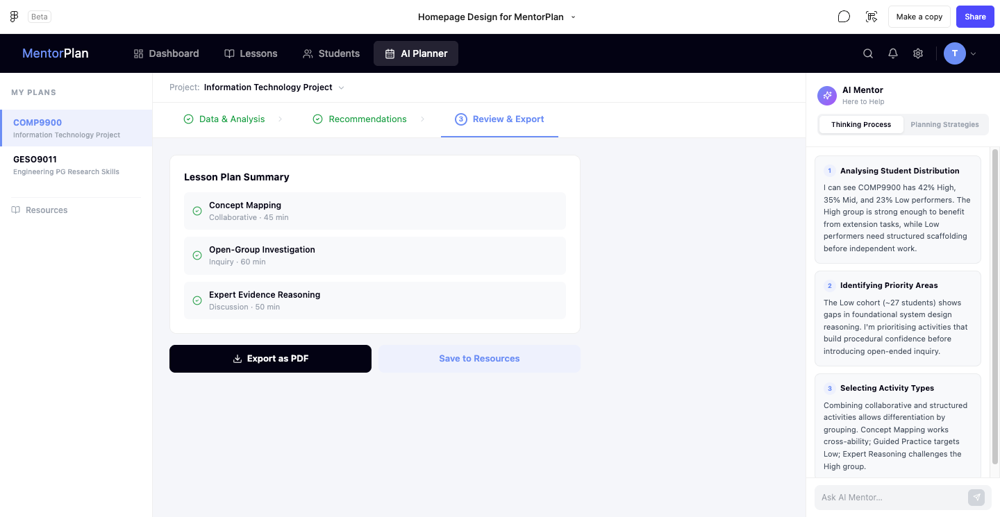

**Covered user stories:** P25-11, P25-13, P25-14, P25-15, P25-16

The Review & Export page is the final stage of the AI Planner workflow. It allows teachers to review selected lesson plan components before exporting or saving the final plan. This ensures that the output is based on teacher-approved decisions rather than generated directly from raw student data.

The main panel shows a Lesson Plan Summary containing selected activities such as Concept Mapping, Open-Group Investigation, and Expert Evidence Reasoning. Each item includes the activity type and estimated duration. The selected activities are shown in a concise summary format so that teachers can confirm whether the final plan matches their instructional goals.

Below the summary, teachers can choose to Export as PDF or Save to Resources. Exporting supports use outside the system, while saving to resources allows the plan to be reused or revised later. This supports both immediate classroom use and longer-term lesson planning workflows.

The AI Mentor panel remains visible on the right side, showing the reasoning trail that led to the selected plan. This helps teachers review whether the final lesson plan still aligns with the original data analysis and recommendation logic.

**Main interactions:**

* The teacher reviews selected lesson activities.
* The teacher confirms that the lesson plan reflects their decisions.
* The teacher exports the final plan as a PDF.
* The teacher saves the plan to resources for future use.
* The system preserves the planning and reasoning trail for revision history.

#### 3.2.7 Overall Navigation Flow

The storyboarded workflow can be summarised as follows:

1. The teacher starts from the **Dashboard** to review course progress and support group distribution.
2. The teacher opens the **Lessons** page to inspect course-level assessments, support groups, and AI group analysis.
3. The teacher uses the **Students** page to upload or verify student data.
4. The teacher enters the **AI Planner** and selects relevant datasets in **Data & Analysis**.
5. The system generates interpretable recommendations in the **Recommendations** stage.
6. The teacher reviews selected items and exports the final plan in **Review & Export**.

This flow supports the project goal of building an AI-mediated teacher decision support tool. The system does not replace teacher judgement. Instead, it helps teachers interpret student data, understand the reasoning behind recommendations, make informed pedagogical decisions, and export a final lesson plan based on approved actions.

---

### 3.3 Design Justifications

#### 3.3.1 Decomposing the Problem into Manageable Subproblems

The overall problem is that pre-service teachers may struggle to interpret student learning data and transform it into evidence-based lesson planning decisions. To make this problem manageable, the project is divided into the following subproblems:

1. **Data collection and preparation**

   Teachers need a way to upload student learning data from sources such as CSV or Excel files. Since different datasets may use different column names or formats, the system must support data preview, column mapping, validation, and cleaning.

2. **Learning analytics generation**

   The system needs to identify class-level patterns, low-scoring areas, common mistakes, strengths, risks, and extension opportunities from the uploaded data.

3. **Visible AI reasoning**

   Instead of simply generating a lesson plan, the system must explain why a recommendation is made, what data evidence supports it, and how it connects to learning outcomes, activities, and assessment.

4. **Teacher decision-making workflow**

   Teachers must remain active decision-makers. They need to be able to accept, reject, edit, or annotate AI-generated recommendations before these suggestions are used in a final lesson plan.

5. **Lesson plan construction and export**

   Approved teacher decisions should be assembled into an editable lesson plan. The final plan should be exportable for use outside the system.

6. **Privacy and traceability**

   Since student data is involved, the system must avoid sending raw student files to AI models. It should also keep records of teacher decisions, plan versions, exports, and anonymised interaction logs.

#### 3.3.2 Layered Architecture

A layered architecture is chosen because it separates responsibilities clearly across the frontend, API layer, service layer, data access layer, and persistence layer.

An alternative design would be to build a simpler monolithic backend where controllers directly process data, call AI services, and write to the database. This would be faster to implement at the beginning, but it would make the system harder to test, extend, and maintain. It would also increase the risk of mixing business logic, data access, and privacy-sensitive operations in the same component.

The chosen layered design is more suitable for this project because:

* Controllers remain lightweight and only handle routing, validation, and authentication.
* Services contain the main workflow and business logic.
* Repositories isolate database and file storage operations.
* The AI adapter hides differences between LLM providers.
* Privacy rules can be enforced at the service and AI boundary layers.

This design supports future extension, such as adding new data formats, new recommendation types, or new AI model providers.

#### 3.3.3 Human-in-the-Loop AI Design

The project deliberately avoids generating a complete final lesson plan directly from raw data. Instead, the system first presents analytics and recommendations, then requires teacher review before a lesson plan is generated.

An alternative approach would be a one-click AI lesson plan generator. This would be convenient, but it would reproduce the black-box limitation of existing generative AI tools. Teachers might receive a polished output without understanding why particular activities or strategies were recommended.

The chosen human-in-the-loop design is more appropriate because:

* Teachers can inspect the evidence behind recommendations.
* Teachers can accept, reject, modify, or annotate AI suggestions.
* The final lesson plan is based on approved decisions rather than raw AI output.
* The system supports teacher agency and professional judgement.
* The reasoning process helps pre-service teachers learn how data informs lesson planning.

This aligns with the project’s goal of supporting cognitive apprenticeship by making expert reasoning visible.

#### 3.3.4 AI Boundary and Privacy Protection

The system uses a strict AI boundary. Raw student files are kept in object storage and are not sent directly to the AI model. The AI only receives lesson context, analytics summaries, approved teacher decisions, and templates.

An alternative approach would be to send the full uploaded CSV or Excel file directly to an LLM for analysis. This could reduce backend development effort, but it creates privacy risks and makes the system overly dependent on the AI model’s interpretation of raw data.

The chosen design is safer and more controlled because:

* Raw student data remains inside the system.
* The backend can clean, validate, and summarise data before AI interaction.
* AI prompts are based on structured summaries rather than uncontrolled raw files.
* Teacher-approved decisions are used before final plan generation.
* The system can provide clearer audit trails and revision history.

This design reduces privacy risk and supports responsible AI use in educational contexts.

#### 3.3.5 Structured Recommendation and Alignment Design

Recommendations are designed to include evidence, reasoning, differentiation, and outcome-activity-assessment alignment. This means each recommendation should explain not only what the teacher could do, but also why it is appropriate.

An alternative design would be to show only activity suggestions, such as “use group work” or “provide scaffolding”. However, this would not adequately support pre-service teachers because it would not explain how the suggestion relates to student data or learning outcomes.

The chosen design provides additional value because:

* Teachers can see which data patterns triggered each recommendation.
* Recommendations are linked to learning outcomes and classroom activities.
* Differentiation strategies can be matched to different support groups.
* Teachers can compare multiple options before deciding.
* The system provides novel functionality beyond standard learning analytics dashboards.

This helps bridge the gap between data visualisation and pedagogical action.

#### 3.3.6 Object Storage for Files and PostgreSQL for Structured Data

The system separates file storage from structured data storage. PostgreSQL stores user accounts, lesson contexts, mappings, analytics results, recommendations, teacher decisions, lesson plans, versions, exports, and logs. Object storage stores larger files such as raw CSV/Excel uploads and exported Word/PDF files.

An alternative approach would be to store all files directly inside the relational database. This would simplify storage in the short term, but it would make the database larger and less efficient.

The chosen design is preferable because:

* Large files are kept outside the database.
* Structured records remain easy to query.
* File metadata can still be tracked in PostgreSQL.
* Exported documents can be stored and retrieved efficiently.
* The design is easier to scale if more datasets or exports are added later.

---

### 3.4 Functionality Mapping

The table below maps the project’s major objectives and functionalities to the corresponding user stories. This demonstrates how the proposed design satisfies the project scope and ensures that each important feature is traceable to the product backlog.

| Project Objective / Functionality              | Related User Stories                          | Justification                                                                                                                                                                           |
| :--------------------------------------------- | :-------------------------------------------- | :-------------------------------------------------------------------------------------------------------------------------------------------------------------------------------------- |
| Lesson context input                           | P25-1                                         | The teacher enters year level, subject area, topic, learning outcomes, lesson goals, learner needs, and constraints. This context guides later analytics and recommendation generation. |
| CSV/Excel student data upload                  | P25-2                                         | The upload function allows teachers to provide synthetic or de-identified learning data for analysis. This is the foundation for data-informed planning.                                |
| Data preview                                   | P25-3                                         | The preview function allows teachers to verify the uploaded dataset before analysis. This reduces the risk of using incorrect or incomplete data.                                       |
| Column mapping                                 | P25-4                                         | Since datasets may use different formats, column mapping allows the system to interpret fields such as student ID, score, topic, skill area, and learning outcome.                      |
| Basic learning analytics                       | P25-5                                         | The analytics module shows class averages, topic performance, low-scoring items, common areas of difficulty, and possible extension opportunities.                                      |
| Initial recommendation with visible reasoning  | P25-6                                         | The system provides early recommendations with supporting evidence and expert lesson planning reasoning, making AI decision-making more transparent.                                    |
| Risk and opportunity summary                   | P25-7                                         | The system summarises class-wide risks, strengths, support needs, and extension opportunities using careful, non-deterministic language.                                                |
| Student grouping suggestions                   | P25-8                                         | The system suggests possible student groups based on learning needs, mixed ability, or extension opportunities, with rationale provided for teacher review.                             |
| Differentiation recommendations                | P25-9                                         | The system recommends strategies such as reteaching, scaffolding, targeted practice, peer support, and extension based on analytics and learning outcomes.                              |
| Outcome-activity-assessment alignment          | P25-10                                        | Each recommendation explains how it aligns with learning outcomes, learning activities, and assessment evidence.                                                                        |
| Teacher accept/reject/modify/annotate workflow | P25-11                                        | Teachers remain responsible for final decisions by reviewing and modifying AI-generated recommendations before they are used in a lesson plan.                                          |
| Teacher reflection prompts                     | P25-12                                        | Reflection prompts encourage teachers to justify why they accepted, rejected, or changed recommendations, supporting professional judgement development.                                |
| AI-supported draft lesson plan                 | P25-13                                        | The system generates a draft lesson plan using teacher context, analytics summaries, approved recommendations, and teacher decisions.                                                   |
| Lesson plan editing                            | P25-14                                        | Teachers can edit lesson objectives, activities, differentiation notes, assessment tasks, and teacher notes before finalising the plan.                                                 |
| Lesson plan export                             | P25-15                                        | The system exports the final lesson plan in a usable format such as Word, PDF, or structured text, allowing use outside the platform.                                                   |
| Revision history                               | P25-16                                        | The system records original AI recommendations, teacher decisions, modified content, and final lesson plan components to support traceability.                                          |
| Educator/researcher dashboard                  | P25-17                                        | The dashboard shows anonymised teacher interaction patterns, helping educators or researchers understand how teachers engage with AI recommendations.                                   |
| Documentation and handover                     | P25-18                                        | The team documents prompt structure, analytics logic, recommendation rules, assumptions, limitations, testing outcomes, and deployment instructions.                                    |
| Privacy-aware AI workflow                      | P25-2, P25-5, P25-6, P25-11, P25-13           | The system avoids sending raw student files to AI models. AI only receives summaries, approved actions, and templates, supporting responsible use of student data.                      |
| Human-in-the-loop lesson planning              | P25-6, P25-10, P25-11, P25-12, P25-13, P25-14 | The system requires teacher review before recommendations become part of a final lesson plan, ensuring that AI supports rather than replaces teacher judgement.                         |

------

### 3.5 Design Justifications

The system is designed based on Cognitive Apprenticeship theory. The project aims to develop an AI-assisted lesson planning guidance tool, rather than only a lesson plan generator. It helps teachers create lesson plans while also showing the reasoning behind them.

For example, the system explains the data evidence, the connection with learning outcomes, the reason for activity design, the choice of assessment methods, and the logic of differentiated teaching. In this way, novice teachers can better connect student learning data, learning outcomes, learning activities, assessment strategies, and learner needs.

#### 3.5.2 Subproblem Breakdown and Proposed Solutions

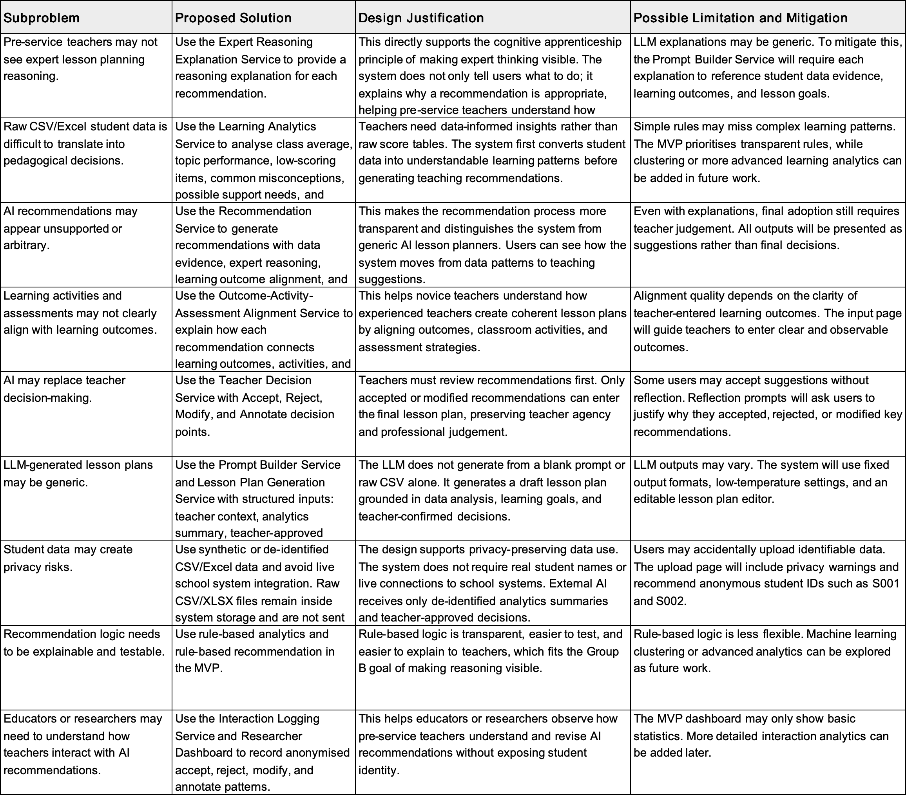

#### 3.5.3 Alternative Solutions Considered

Considering the project objectives, project timeline, system feasibility, privacy risks, and the theoretical direction of Group B, the project team compared several feasible methods, as shown in the table below.

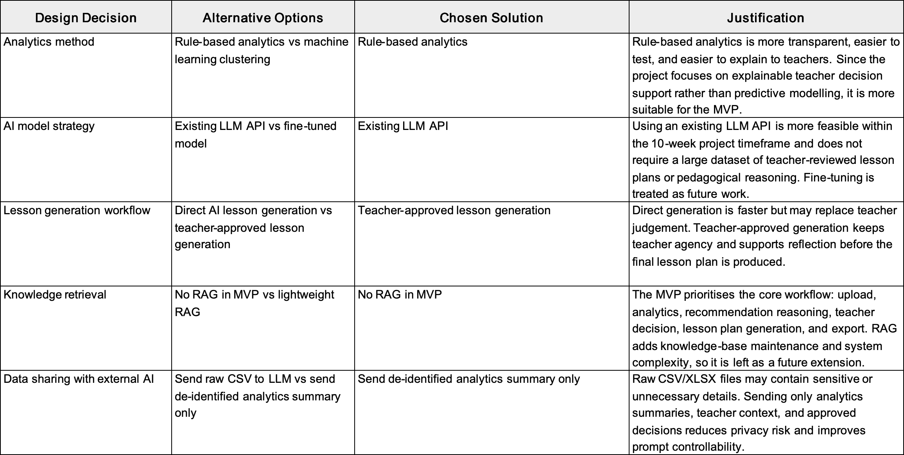

#### 3.5.4 Novel Functionality Beyond Existing Systems

The project team studied two existing system categories: generative AI lesson planning tools and learning analytics dashboards. The limitations of these existing systems and the innovations of MentorPlan AI are shown in the table below.

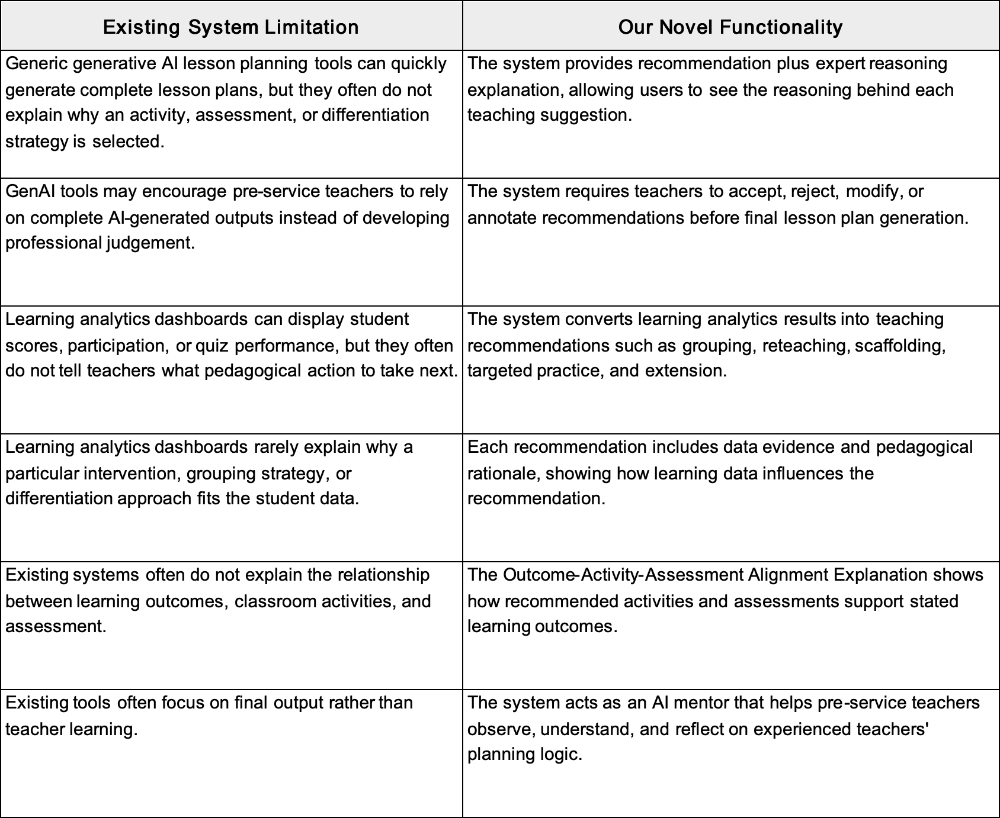

#### 3.5.5 Limitations and Mitigation Strategies

Although this MVP can support data analysis and expert reasoning, there are still some limitations, as shown in the table below.

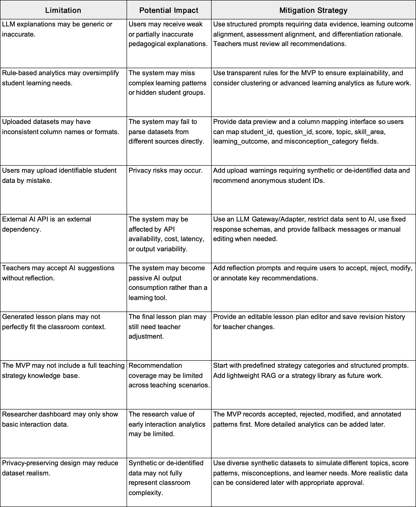

Overall, the MVP design gives priority to explainability, feasibility, privacy protection, and teacher control. Complex models, full retrieval-augmented generation, and advanced learning analytics can be considered as future work. The current version focuses on clearly showing the relationship between student data, recommendations, expert reasoning, and teacher decisions.

## 4. References

Australian Institute for Teaching and School Leadership. (2011). *Australian professional standards for teachers*. AITSL.

Collins, A., Brown, J. S., & Newman, S. E. (1986). *Cognitive apprenticeship: Teaching the craft of reading, writing, and mathematics* (Technical Report No. 403). Center for the Study of Reading, University of Illinois at Urbana-Champaign.

Denny, P., Gulwani, S., Heffernan, N. T., Käser, T., Moore, S., Rafferty, A. N., & Singla, A. (2024). *Generative AI for education (GAIED): Advances, opportunities, and challenges*. arXiv. https://doi.org/10.48550/arXiv.2402.01580

Instructure. (2026). *Canvas New Analytics*. https://www.instructure.com/canvas

Kahoot!. (2026). *Kahoot! reports and analytics*. https://kahoot.com/

MagicSchool AI. (2026). *MagicSchool AI: The AI platform for educators*. https://www.magicschool.ai/

Mandinach, E. B., & Gummer, E. S. (2016a). Every teacher should succeed with data literacy. *Phi Delta Kappan, 97*(8), 43–46. https://doi.org/10.1177/0031721716647018

Mandinach, E. B., & Gummer, E. S. (2016b). What does it mean for teachers to be data literate: Laying out the skills, knowledge, and dispositions. *Teaching and Teacher Education, 60*, 366–376. https://doi.org/10.1016/j.tate.2016.07.011

OECD. (2025). *Results from TALIS 2024: The state of teaching*. OECD Publishing. https://doi.org/10.1787/90df6235-en

OpenAI. (2026). *ChatGPT*. https://chat.openai.com/

UNESCO. (2023). *Guidance for generative AI in education and research*. UNESCO. https://doi.org/10.54675/EWZM9535
